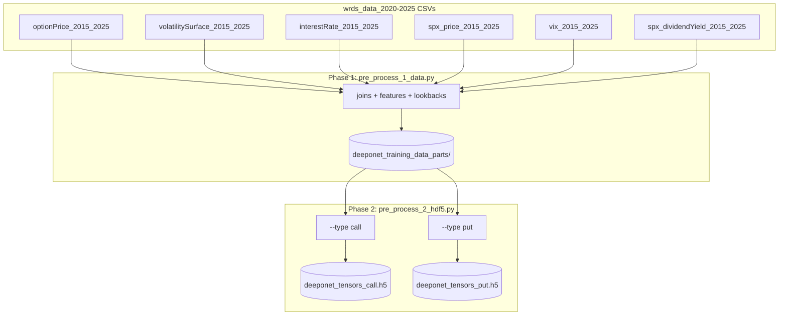

# WRDS 2015–2025 preprocessing plan

**Scope:** Phases 1–2 (Polars → parquet → per-type HDF5) plus inspection/validation.  
**Deferred:** training, evaluation, `final_report.tex` — see [Future work (train_code/)](#future-work-train_code).

---

## Running the pipeline (reference only)

All scripts are run from `wrds_data_2020-2025/` after activating the project conda environment:

```bash
conda activate dl_new
cd wrds_data_2020-2025
python pre_process_1_data.py
python pre_process_2_hdf5.py --type call
python pre_process_2_hdf5.py --type put
python pre_process_3_print_dataset.py
```

Do **not** assume a smoke/full run is part of implementation delivery unless explicitly requested.

---

## Context (current vs target)


| Area               | Old (`[wrds_data/](wrds_data/)`)      | Target (`[wrds_data_2020-2025/](wrds_data_2020-2025/)`)                                                              |
| ------------------ | ------------------------------------- | -------------------------------------------------------------------------------------------------------------------- |
| Date range         | ~1 year (2024-08 → 2025-08)           | 2015-01 → 2025-08 (`*_2015_2025.csv`)                                                                                |
| Options            | Calls only                            | Calls **and** puts                                                                                                   |
| Liquidity filter   | `open_interest > 100`, `best_bid > 0` | `**volume > 0`**                                                                                                     |
| Trunk / target     | `M`, `v = V/K`                        | `log(S/K)`, `log(V/K)` (+ raw cols in parquet)                                                                       |
| Branch input       | Implied vol surface only (374-d)      | **187-d** vol surface per `cp_flag` **plus** SPX OHLC lookback **plus** VIX OHLC lookback (training picks one later) |
| Vol surface join   | By `date` only (C/P mixed)            | By `['date', 'cp_flag']` (187 = 11 tenors × 17 deltas)                                                               |
| Spot / VIX history | None                                  | `x` trading-day OHLC windows; dataset starts at trade date index `x`                                                 |
| Split              | Row index in training code            | `date` + `split_id` in HDF5 (80/10/10 by calendar date)                                                              |


---

## Design choices (confirmed)

- **log(S/K)** and **log(V/K)** as primary supervised coordinates in HDF5
- **Separate call and put HDF5 files** (`deeponet_tensors_call.h5`, `deeponet_tensors_put.h5`)
- **Three branch-input options** exported together; `train_code/` will choose implied vol vs SPX history vs VIX history (not decided in preprocessing)
- **Dataset trim:** drop the first `SPOT_LOOKBACK_DAYS` trade dates so every row has a full `x`-day lookback (no left-padding)

---

## Pipeline overview




---

## Shared configuration

Top of `[pre_process_1_data.py](wrds_data_2020-2025/pre_process_1_data.py)` (paths relative to script directory):

```python
OPTION_PRICE_CSV = "optionPrice_2015_2025.csv"
VOL_SURFACE_CSV = "volatilitySurface_2015_2025.csv"
INTEREST_RATE_CSV = "interestRate_2015_2025.csv"
SPX_PRICE_CSV = "spx_price_2015_2025.csv"
VIX_CSV = "vix_2015_2025.csv"
DIVIDEND_CSV = "spx_dividendYield_2015_2025.csv"

SECID = 108105
SPOT_LOOKBACK_DAYS = 21   # x: trading days incl. trade date d
LOG_EPS = 1e-8

OUTPUT_PARQUET = "deeponet_training_data.parquet"
PARTS_DIR = "deeponet_training_data_parts"
VOL_SURFACE_DIM = 187   # 11 tenors x 17 deltas per cp_flag
```

Document `SPOT_LOOKBACK_DAYS` and the `volume > 0` filter in `[wrds_data_2020-2025/README.txt](wrds_data_2020-2025/README.txt)`.

**CLI (Phase 1):** `--date-start`, `--date-end` (smoke slices), `--lookback-days`, `--force` (rebuild yearly parts). Full runs skip existing part files unless `--force`.

---

# Phase 1 — `pre_process_1_data.py` (parquet)

**Script:** `[wrds_data_2020-2025/pre_process_1_data.py](wrds_data_2020-2025/pre_process_1_data.py)`  
**Template:** `[wrds_data/pre_process_1_data.py](wrds_data/pre_process_1_data.py)`  
**Output (primary):** `deeponet_training_data_parts/deeponet_training_data_YYYY.parquet` (one file per year; resume skips existing years unless `--force`). The `OUTPUT_PARQUET` constant is not written by the default full run.

### 1.1 Load inputs (lazy `scan_csv`)


| Role        | File                              | Key columns                                                                        |
| ----------- | --------------------------------- | ---------------------------------------------------------------------------------- |
| Options     | `optionPrice_2015_2025.csv`       | `date`, `exdate`, `cp_flag`, `strike_price`, `best_bid`, `best_offer`, `volume`, … |
| Vol surface | `volatilitySurface_2015_2025.csv` | `date`, `days`, `delta`, `impl_volatility`, `cp_flag`                              |
| Rates       | `interestRate_2015_2025.csv`      | `date`, `days`, `rate`                                                             |
| SPX spot    | `spx_price_2015_2025.csv`         | `date`, `open`, `high`, `low`, `close`, `volume`                                   |
| VIX         | `vix_2015_2025.csv`               | `date`, `open`, `high`, `low`, `close`                                             |
| Dividends   | `spx_dividendYield_2015_2025.csv` | `date`, `expiration`, `rate`                                                       |


Filter `secid == 108105` where the column exists (options, vol surface, SPX, dividends). **VIX** is loaded without a `secid` filter (index series has no `secid` column).

### 1.2 Option filtering

```python
pl.col('cp_flag').is_in(['C', 'P'])
& (pl.col('volume') > 0)
```

Removed (old pipeline): `open_interest > 100`, `best_bid > 0`.

Derived fields (unchanged logic):

- `strike = strike_price / 1000`
- `mid_price = (best_bid + best_offer) / 2`
- `days_to_expiry = (exdate - date).days`
- `moneyness = spot / strike` (join SPX `close` as `spot` on `date`)
- `T_years = days_to_expiry / 365`
- `normalized_price = mid_price / strike`
- `r`: `join_asof` on `days_to_expiry` ↔ `interestRate.days` by `date`
- `q`: dividend join on `(date, exdate)`, fill null with `0`

### 1.3 Log features

```python
log_moneyness = log(moneyness.clip(lower=LOG_EPS))
log_normalized_price = log(normalized_price.clip(lower=LOG_EPS))
```

Keep in parquet: `row_id`, `date`, `exdate`, `cp_flag`, `volume`, `strike`, `spot`, `moneyness`, `normalized_price`, `days_to_expiry`, `T_years`, `q`, `r`, `vol_surface_vector`, `log_moneyness`, `log_normalized_price`, `spot_history_tensor`, `vix_history_tensor`. (`mid_price` is used in the pipeline but not stored in the final parquet.)

### 1.4 Implied volatility surface (default branch)

Aggregate **per (`date`, `cp_flag`)** — not per date alone:

```python
.sort(['days', 'delta'])
.group_by(['date', 'cp_flag'])
.agg(pl.col('impl_volatility').alias('vol_surface_vector'))
```

Join to options on `['date', 'cp_flag']`.

**Validation:** `len(vol_surface_vector) == 187` (11 tenors × 17 deltas per `cp_flag`). On failure, log `(date, cp_flag, len)` sample and **drop** invalid rows (WARNING).

### 1.5 SPX OHLC lookback — alternative to vol surface (`spot_history`)

**Source:** `spx_price_2015_2025.csv` — columns `open`, `high`, `low`, `close`, `volume`.

**Purpose:** Fixed-length recent SPX path per trade date for Network 1 σ estimation when training **does not** use `branch_u`.

**Steps:**

1. Build `spx_daily` sorted by `date` with `[open, high, low, close, volume]`.
2. For each trade date `d`, take the last `x = SPOT_LOOKBACK_DAYS` **rows** of `spx_daily` with `date <= d` (inclusive).
3. **Trim:** after building lookbacks, drop all option rows with `date` before the `x`-th distinct trade date in `spx_daily` (equivalently: require a full `x`-day history for every retained row — **no left-padding**).
4. Store `spot_history_tensor` as nested `**(x, 5)`** — OHLCV (volume included; see README).

**Normalization:** divide `open, high, low, close` by `close` on day `d` (last row → 1.0); scale `volume` by its value on day `d`. Parquet stores normalized nested tensors; HDF5 exports flattened normalized `spot_history`.

### 1.6 VIX OHLC lookback — second alternative (`vix_history`)

**Source:** `vix_2015_2025.csv` — columns `open`, `high`, `low`, `close`.

Same windowing and **same trim rule** as §1.5, using a separate `vix_daily` table.

Store `vix_history_tensor` as nested `(x, 4)`.

**Normalization:** divide OHLC by `close` on day `d` (last close = 1.0).

> **Note:** §1.5 (SPX) and §1.6 (VIX) are independent lookbacks; both are written to parquet. Training later selects one branch input.

### 1.7 Chronological sort and row metadata

```python
.sort(['date', 'cp_flag', 'days_to_expiry', 'strike'])
```

Monotonic `row_id` (**UInt32** via `with_row_index`).

### 1.8 Memory / execution

- Polars **lazy** scans; per-year `collect(engine="streaming")` then `write_parquet` into `deeponet_training_data_parts/`
- **Smoke / slice:** `--date-start` / `--date-end` (e.g. 2020–2021); `**--force`** rebuilds part files
- **Resume:** skip years whose part file already exists (unless `--force`)
- Expect long runtime and large parquet on full data (~8.6 GB options file)

### 1.9 Phase 1 deliverable checklist

Validated full run (2026-05-17); first parquet date **2015-02-02** after 21-day warmup.

- Parquet contains C and P rows with `volume > 0`
- `vol_surface_vector` length 187 for sample dates × both flags
- No option rows before SPX/VIX lookback warmup dates
- `spot_history_tensor` shape `(21, 5)`; `vix_history_tensor` shape `(21, 4)`
- `log_`* columns finite on full dataset

---

# Phase 2 — `pre_process_2_hdf5.py` (per-type HDF5)

**Script:** `[wrds_data_2020-2025/pre_process_2_hdf5.py](wrds_data_2020-2025/pre_process_2_hdf5.py)`  
**Template:** `[wrds_data/pre_process_2_hdf5.py](wrds_data/pre_process_2_hdf5.py)`  
**Input (primary):** `deeponet_training_data_parts/` (yearly parquets). Falls back to `deeponet_training_data.parquet` or `--input` path (file or directory).

### 2.1 CLI

```bash
conda activate dl_new
python pre_process_2_hdf5.py --type call   # -> deeponet_tensors_call.h5
python pre_process_2_hdf5.py --type put    # -> deeponet_tensors_put.h5
```

Optional: `--input PATH` (single parquet, or directory of part files).

Filter: `cp_flag == 'C'` or `'P'`.  
`drop_nulls` on: `log_moneyness`, `T_years`, `r`, `q`, `log_normalized_price`, `vol_surface_vector`, `spot_history_tensor`, `vix_history_tensor`, `moneyness`, `normalized_price`, `date`.

### 2.2 HDF5 datasets (per file)


| Dataset            | Shape      | Role                                                                         |
| ------------------ | ---------- | ---------------------------------------------------------------------------- |
| `branch_u`         | `(N, 187)` | Implied vol surface (FNO branch, default); 11 tenors × 17 deltas per cp_flag |
| `spot_history`     | `(N, 105)` | Flattened normalized SPX OHLCV lookback (`x=21` → 21×5)                      |
| `vix_history`      | `(N, 84)`  | Flattened normalized VIX OHLC lookback (`x=21` → 21×4)                       |
| `trunk_y`          | `(N, 4)`   | `[log_moneyness, T_years, r, q]`                                             |
| `target_v_log`     | `(N, 1)`   | `log_normalized_price`                                                       |
| `moneyness`        | `(N, 1)`   | eval / back-transform                                                        |
| `normalized_price` | `(N, 1)`   | eval / back-transform                                                        |
| `date`             | `(N,)`     | ISO date strings (`S10`, e.g. `2020-01-02`)                                  |
| `split_id`         | `(N,)`     | `uint8`: 0=train, 1=val, 2=test                                              |


Flatten nested tensors in NumPy before `h5py.create_dataset` (same pattern as old `vol_surface_vector` stacking).

**Training branch selection (future):** loaders read one of `branch_u`, `spot_history`, or `vix_history`; preprocessing always exports all three.

### 2.3 Chronological 80/10/10 split

1. Unique `date` values in sorted order (after Phase 1 trim).
2. First 80% of dates → `split_id = 0`, next 10% → `1`, last 10% → `2`.
3. Map every row by its `date`.

Assert: `max(date | split=0) < min(date | split=1) < min(date | split=2)`.

No changes to `[OLD_Final_model_evaluation/training.py](OLD_Final_model_evaluation/training.py)` in this plan.

### 2.4 Phase 2 deliverable checklist

Validated full run (2026-05-17); HDF5 sizes consistent with parquet C/P row counts (~5.25M call, ~8.34M put).

- `deeponet_tensors_call.h5` and `deeponet_tensors_put.h5` created
- `branch_u.shape[1] == 187` (11 tenors × 17 deltas per cp_flag)
- `spot_history` / `vix_history` widths 105 / 84 for `x=21`
- `split_id` only uses `{0,1,2}`; no date leakage across splits (by construction)
- Row counts logged: N_call, N_put, N_train/val/test per file

---

## Phase 3 — Inspection and validation (lightweight)

**Script:** `[pre_process_3_print_dataset.py](wrds_data_2020-2025/pre_process_3_print_dataset.py)`

Reports:

- Row counts by `cp_flag`; date range before/after lookback trim
- Null rates on joins (`r`, `q`, vol surface)
- `u_dim`, `spot_history` / `vix_history` shapes
- `log_normalized_price` quantiles
- Split date boundaries and rows per `split_id`

Cross-checks from Phase 1 §1.9 and Phase 2 §2.4.

---

## File layout

```
wrds_data_2020-2025/
  pre_process_1_data.py
  pre_process_2_hdf5.py
  pre_process_3_print_dataset.py
  README.txt                 # conda env dl_new, SPOT_LOOKBACK_DAYS, filters, run order
  deeponet_training_data_parts/
    deeponet_training_data_2015.parquet
    ...                      # one file per year (primary Phase 1 output)
  deeponet_tensors_call.h5
  deeponet_tensors_put.h5

train_code/                  # FUTURE
  training_call.py
  training_put.py
  evaluation.py

wrds_data/                   # legacy 1-year baseline (unchanged)
```

---

## Risks and mitigations


| Risk                                         | Mitigation                                                                                    |
| -------------------------------------------- | --------------------------------------------------------------------------------------------- |
| RAM on large `optionPrice` CSV               | Lazy Polars; yearly chunks; `collect(engine="streaming")`; date-slice smoke                   |
| Fewer rows after `volume > 0` vs old filters | Log retention rate; compare C/P counts                                                        |
| Warmup trim drops early years                | Expected; document first usable date in README                                                |
| Vol vector length ≠ 187 on some days         | Drop invalid rows + diagnostic log; fix sort/group keys                                       |
| SPX vs VIX calendar misalignment             | Build lookbacks from each series separately; inner-join options only after both joins succeed |


---

## Future work (train_code/) — not part of Phases 1–2

Brief pointer only; verify against `[final_report.tex](final_report.tex)` when implementing.

- **Branch choice:** train with `branch_u` (iv surface) **or** `spot_history` **or** `vix_history`
- **Separate call/put models** reading respective HDF5 files
- **Put-specific** terminal / boundary / arbitrage losses
- **Greeks supervision** (optional: add `market_delta/gamma/vega` back into Phase 1–2 if needed)
- **Network-2 BS anchoring:** `L_BS = ||v_hat - v_BS(M, τ; r, q, σ_hat)||²` with analytical BS per `cp_flag`
- **PDE in price space:** evaluate residual on `v = exp(log_v_hat)`

Fork from `[OLD_Final_model_evaluation/training.py](OLD_Final_model_evaluation/training.py)`.

---

## Out of scope (this plan)

- Implementing or running training / hyperparameter search
- Updating `final_report.tex`
- Single combined call+put model

