# Phase 2 v2 — Two-Stage Training: Pre-train Network 2 as BS Pricer, Then Train Network 1 as IV Estimator

## Key Changes from the Original Plan

1. **`train_model_v2/` instead of modifying `train_model/` in-place** — the existing `train_model/` is preserved unchanged; all new and modified files go under `train_model_v2/`.
2. **SiLU activation everywhere** — all activation functions in neural network layers use `F.silu()` (also known as Swish). The `F.relu()` in arbitrage penalty terms stay as-is (they are loss constraints, not activations).
3. **Network 2 pre-trained to very low error** — aim for MSE < 1e-8 on a held-out synthetic test set (or at least machine epsilon). This requires more aggressive training: more epochs, cosine annealing scheduler, and a synthetic validation set to measure convergence.

## Problem

The current Phase 2 joint training has four competing losses. Network 2's BS analytical approximation (the `bs_anchor` loss) competes with data, PDE, and arbitrage gradients. As a result:

- Network 2 never fully converges to the BS formula
- The BS anchor loss remains high without meaningfully helping accuracy
- Network 1 cannot focus purely on IV estimation because Network 2 is a moving target

## Data flow

```mermaid
flowchart TD
    subgraph Stage1["Stage 1: Pre-train Net2"]
        synth["Synthetic (log_m, T, r, q, sigma)"] --> net2["Network 2 (MLP, SiLU)"]
        bs["BS Analytical Price<br/>formula"] --> target["target = log(V_BS/K)"]
        net2 --> logv_hat["log_v_hat"]
        target --> loss["MSE (aim < 1e-8)"]
        logv_hat --> loss
        loss -.-> updateNet2["update net2 weights"]
        updateNet2 -.-> net2
    end

    subgraph Stage2["Stage 2: Train Net1 with frozen Net2"]
        branch["Market state grid<br/>(IV surface / SPX / VIX)"] --> fno["Network 1<br/>FNO_VolEstimator<br/>(SiLU activations)"]
        fno --> sigma_hat["sigma_hat"]
        market["Market (log_m, T, r, q)"] --> concat["[log_m, T, r, q, sigma_hat]"]
        sigma_hat --> concat
        concat --> frozenNet2["Network 2<br/>FROZEN"]
        frozenNet2 --> logv_hat2["log_v_hat"]
        targetV["target_v_log (market)"] --> loss2["MSE"]
        logv_hat2 --> loss2
        loss2 -.-> updateNet1["update net1 weights ONLY"]
        updateNet1 -.-> fno
    end
```



## Solution: Decoupled Two-Stage Training

### Stage 1: Pre-train Network 2 as a High-Precision BS Analytical Pricer

Network 2 will be trained to **near-machine precision** on the BS formula so that any remaining error in the final combined model is attributable to Network 1's volatility estimation, not to Network 2's BS approximation.

**Architecture update:**

Replace all activations with SiLU:

- `F.gelu()` in `FNO_VolEstimator` becomes `F.silu()`
- `nn.Tanh()` in `MLP_Predictor` becomes `nn.SiLU()`
- The output layer of `MLP_Predictor` remains **no activation** (unconstrained output for `log_v_hat`)
- The `F.softplus()` on Network 1's output stays as-is (it enforces positivity of sigma)

**Input normalization baked into Network 2** (added after empirical results showed loss plateau at ~2.4e-2):

- `MLP_Predictor` registers two non-trainable buffers `input_mean[5]` and `input_std[5]`.
- These are populated once in Stage 1 from the **training synthetic inputs** (`set_input_stats(mean, std)` after dataset generation).
- `forward(x)` applies `(x - input_mean) / input_std` internally — callers must never pre-normalize.
- Because they are `register_buffer`, the stats are serialized via `state_dict` and load automatically with `model.net2.load_state_dict(...)` in Stage 2.

**Training details:**

- **Network 2 only**, completely standalone.
- Input: `[log_moneyness, T_years, r, q, sigma]` — 5-dimensional.
- Target: `log(BS_normalized_price(log_moneyness, T_years, r, q, sigma, option_type))`.
- **Single loss**: MSE between Network 2's `log_v_hat` and the analytical `log(BS_price)`.
- **No PDE, no arbitrage, no data loss.**
- Synthetic data sampled from ranges that **cover the empirical market data ranges** (computed once from the HDF5 file). The training set uses 500k synthetic samples; the test/validation set uses 100k held-out samples.
- **Tail filtering**: before taking `log(price)`, drop samples whose un-clamped BS price < `MIN_PRICE = 1e-6`. Without this, deep-OTM / low-σ / short-T samples saturate at the price floor and contribute pinned `log` targets (≈ −23) that the network cannot fit. Generation oversamples (≥2×) and trims to the target count after filtering.
- **Aggressive training to reach very low error:**
  - `epochs = 500` (with early stopping patience=50)
  - `batch_size = 1024` (larger batches for smoother gradients)
  - `lr = 1e-3` with **`CosineAnnealingLR(T_max=epochs, eta_min=1e-6)`** (stepped per-epoch, no arg). An earlier `ReduceLROnPlateau` collapsed LR to its floor by epoch ~300 and left training stuck at ~2.4e-2.
  - Monitor **synthetic validation MSE** as the primary metric
  - Target: test MSE < 1e-8 in log space
  - Optionally: widen MLP to `hidden_dim=256` if needed for lower error
- Save `net2_pretrained.pth`.

**Why very low error is achievable**: The mapping `(log_moneyness, T, r, q, sigma) -> log(V/K)` is smooth and Lipschitz-continuous over our bounded domain. An MLP with 4 layers of width 128 and SiLU activations can approximate it arbitrarily well with enough training iterations, since SiLU (like GELU) is a smooth activation that supports higher-order derivative approximation.

### Stage 2: Train Network 1 with Frozen Network 2

- Network 2 is loaded from Stage 1 and **frozen** (`requires_grad = False`).
- Only Network 1 (`FNO_VolEstimator`) is trained.
- Input: market state grid (IV surface / SPX history / VIX history).
- Forward pass: `branch -> Network 1 -> sigma_hat -> frozen Network 2 -> log_v_hat`.
- **Primary loss**: MSE between `log_v_hat` and market `target_v_log`.
- PDE and arbitrage losses are **dropped entirely** — since Network 2 is a near-exact BS approximator, the combined output automatically satisfies the BS PDE and no-arbitrage constraints for any sigma_hat. Any residual PDE/arb error at the BS exact solution would be negligible.
- The BS anchor loss is removed — it is baked into Network 2's frozen weights.
- Training: standard two-phase Adam + fine-tune, but only Network 1 parameters are optimized.

**Why this works**: The only free parameter in BS that varies with market state is `sigma`. By freezing Network 2, Network 1 is forced to learn the mapping from market state to implied volatility — the sigma that makes BS exactly match the observed price.

## Directory Structure

```
train_model_v2/
  call/
    pretrain_net2.py              [NEW] — Stage 1 for calls
    pretrained_net2/              [NEW]
      net2_pretrained.pth
      config.json
      loss_history.txt
      loss_plot.png
    train_vol_surface.py          [MODIFIED copy] — uses net2 from pretrained_net2/
    train_spot_history.py         [MODIFIED copy] — same
    train_vix_history.py          [MODIFIED copy] — same
    results_vol_surface/
    results_spot_history/
    results_vix_history/
  put/
    pretrain_net2.py              [NEW] — Stage 1 for puts
    pretrained_net2/              [NEW]
      net2_pretrained.pth
      config.json
      loss_history.txt
      loss_plot.png
    train_vol_surface.py          [MODIFIED copy] — uses net2 from pretrained_net2/
    train_spot_history.py         [MODIFIED copy] — same
    train_vix_history.py          [MODIFIED copy] — same
    results_vol_surface/
    results_spot_history/
    results_vix_history/
```

The `train_model/` directory is **not touched**.

## Required Changes

### 1. Create `train_model_v2/` directory tree and copy files

The 6 training scripts from `train_model/` are copied verbatim into `train_model_v2/` preserving the same subdirectory structure. These copies will then be modified.

### 2. New file: `train_model_v2/call/pretrain_net2.py` (and `train_model_v2/put/pretrain_net2.py`)

A standalone script that:

1. Reuses the `MLP_Predictor` class with activations changed to `nn.SiLU()` and two non-trainable buffers `input_mean[5]`, `input_std[5]` consumed in `forward`.
2. Reads the HDF5 training split once to compute empirical ranges for `log_moneyness`, `T_years`, `r`, `q`.
3. Generates 500k synthetic samples from ranges that cover the empirical data (with buffer), oversampling and **filtering** any sample whose un-clamped BS price < `1e-6` before taking `log()`.
4. Computes `bs_normalized_price(...)` for the given `option_type` (returned **unclamped** — caller filters), then takes `log()` on the kept samples.
5. Generates 100k held-out synthetic test/validation samples from the same distribution and filter.
6. Computes per-feature mean/std from the (filtered) training inputs and calls `model.set_input_stats(...)`. These stats are stored as buffers and serialized with the checkpoint.
7. Trains Network 2 with Adam + MSE + **`CosineAnnealingLR(T_max=epochs, eta_min=1e-6)`**, stepped each epoch.
8. Monitors synthetic validation MSE and saves best checkpoint.
9. Targets test MSE < 1e-8.
10. Saves to `train_model_v2/call/pretrained_net2/` (or `train_model_v2/put/pretrained_net2/`).

CLI flags: `--epochs` (default 500), `--batch-size` (default 1024), `--lr` (default 1e-3), `--hidden-dim` (default 128), `--num-layers` (default 4), `--seed`, `--target-n-samples` (default 500000).

### 3. Modified files: all 6 v2 training scripts

Each script in `train_model_v2/` receives the same set of changes:

**a. Architecture: SiLU activation replacement + input-norm buffers in `MLP_Predictor`**

In `FNO_VolEstimator.forward`: all 6 instances of `F.gelu(...)` become `F.silu(...)`.

In `MLP_Predictor.__init__`: both instances of `nn.Tanh()` become `nn.SiLU()`, AND the class must register two non-trainable buffers and apply them in `forward`:

```python
self.register_buffer("input_mean", torch.zeros(input_dim))
self.register_buffer("input_std",  torch.ones(input_dim))

def set_input_stats(self, mean, std):
    self.input_mean.copy_(mean.to(self.input_mean.device))
    self.input_std.copy_(std.to(self.input_std.device))

def forward(self, x):
    return self.net((x - self.input_mean) / self.input_std)
```

This is required so that `model.net2.load_state_dict(net2_state)` accepts the pretrained checkpoint (the buffers are keys in `state_dict`). The values come from the pretrained file; Stage 2 never recomputes them.

**Important**: Stage-2 callers (the FNO branch, the synthetic PDE/arb sampling code that previously fed `net2`, anywhere else that calls `model.net2(...)`) must pass **raw** `[log_m, T, r, q, sigma]` — normalization is internal. Strip any pre-normalization that may have existed.

**b. Add `freeze_net2()` method to `TwoNetworkModel`**

```python
def freeze_net2(self):
    self.net2.requires_grad_(False)
```

**c. Update config defaults**

| Parameter | Old value | New value |
|-----------|-----------|-----------|
| `lambda_pde` | 0.5 | 0.5 |
| `lambda_arb` | 0.5 | 0.5 |
| `lambda_bs_anchor` | 0.5 | 0.5 |

**d. Remove BS anchor loss generation from `compute_loss`**

The synthetic sampling and MSE computation for `bs_anchor` are removed entirely. The `compute_loss` function no longer has a `bs_anchor_batch_size` parameter and only returns data loss + (removed) pde/arb.

**e. Load pretrained Network 2 weights**

```python
pretrained_path = config["pretrained_net2_path"]
net2_state = torch.load(pretrained_path, map_location=device)
# Only load net2 keys into the TwoNetworkModel
model.net2.load_state_dict(net2_state)
model.freeze_net2()
```

**f. Optimizer only for Network 1**

```python
optimizer_adam = optim.Adam(model.net1.parameters(), lr=lr, weight_decay=1e-5)
```

**g. CLI arg**

Add `--pretrained-net2 <path>` with a sensible default pointing to `../pretrained_net2/net2_pretrained.pth` relative to the script.

### Synthetic data ranges for Stage 1

Computed once from the HDF5 training split, then used throughout:

| Parameter | Synthetic sampling range |
|-----------|-------------------------|
| log_moneyness | [emp_min - 0.2, emp_max + 0.2] |
| T_years | [max(1/365, emp_min - 0.1), emp_max + 0.5] |
| r | [emp_min - 0.01, emp_max + 0.01] |
| q | [emp_min - 0.01, emp_max + 0.01] |
| sigma | [0.05, 1.00] (hardcoded) |

## Training Outputs

### Stage 1 (pretrain_net2.py)

Output directory: `train_model_v2/call/pretrained_net2/` (or put equivalent)

- `net2_pretrained.pth` — best checkpoint (includes `input_mean`/`input_std` buffers)
- `net2_final.pth` — final checkpoint
- `config.json`
- `loss_history.txt`
- `loss_plot.png`
- Final test MSE (log space) — expected < 1e-8

The checkpoint's `state_dict` includes `input_mean` and `input_std` as registered buffers. Stage 2's `MLP_Predictor` class **must** declare those same buffers; otherwise `load_state_dict(strict=True)` raises an "unexpected keys" error.

### Stage 2 (each training script)

Output directory: `train_model_v2/{call,put}/results_{vol_surface,spot_history,vix_history}/`

- `best_model_phase1.pth`
- `best_model.pth`
- `final_model.pth`
- `config.json` (includes `pretrained_net2_path` and `net2_test_mse` metadata)
- `loss_history.txt`
- `loss_plot.png`
- test MSE/RMSE in log and price space

## Test Plan

1. **Copy validation**: Verify `train_model_v2/` exists with all 6 scripts, each runs with original behavior before modifications.

2. **Stage 1 smoke test**: Run `pretrain_net2.py --epochs 2 --batch-size 64 --target-n-samples 1000`. Verify synthetic data gen, BS price computation, net2 saves, loss decreases.

3. **Stage 1 convergence test**: Run `pretrain_net2.py --epochs 500` (or until early stop). Verify test MSE < 1e-8 on held-out synthetic set.

4. **Stage 2 smoke test**: Run one of the v2 training scripts with `--epochs-adam 1 --epochs-finetune 0 --max-train-batches 2`. Verify:
   - Pretrained net2 loads with `strict=True` (i.e., `input_mean`/`input_std` buffers match) and is frozen
   - Only net1 params in optimizer
   - No code path in Stage 2 normalizes inputs before passing them to `net2` (normalization is internal)
   - Forward/backward pass works
   - Output saved correctly

5. **Stage 2 full test**: Run a full training (e.g., vol surface for calls) and compare test metrics against original Phase 2 results.
