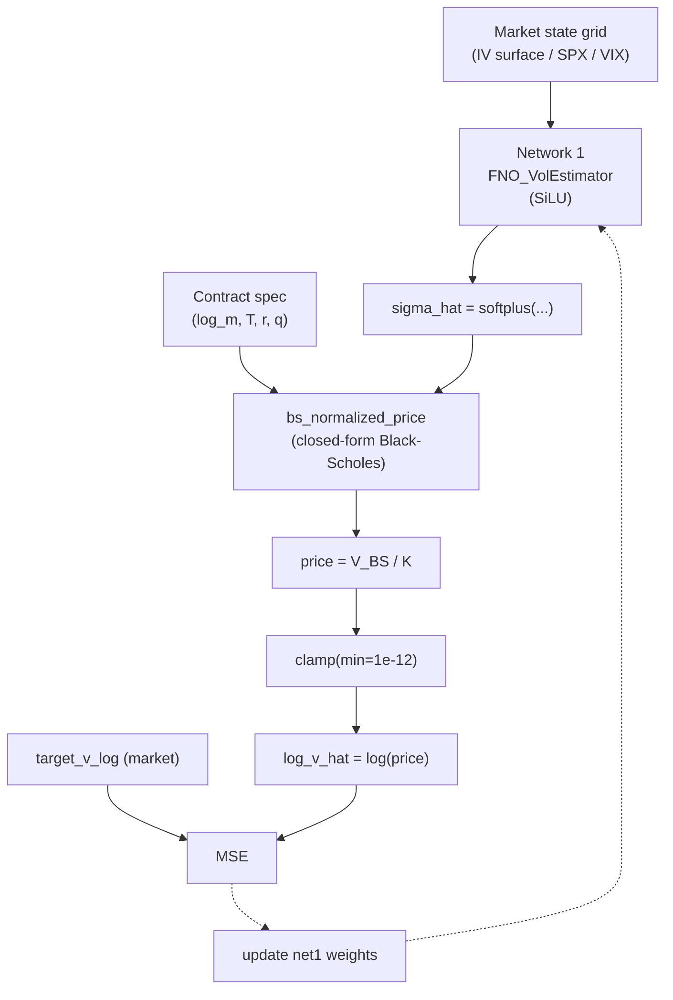

# Phase 2 v3 — Replace Network 2 with the Analytical Black-Scholes Formula

## Key Idea

Phase 2 v2 used a pre-trained MLP (Network 2) as a near-exact BS pricer. In v3 we go the obvious step further and **delete Network 2 entirely**, replacing it with the closed-form Black-Scholes price `bs_normalized_price(...)`. Because PyTorch's elementary ops (`exp`, `erf`, `sqrt`, `clamp`) are differentiable, gradients flow from the data MSE loss back through the analytical BS formula and into Network 1 without any intermediate neural surrogate.

The training problem becomes a clean implied-volatility estimation problem:

> Given a market state (IV surface / SPX history / VIX history) and the option contract spec `(log_moneyness, T, r, q)`, find the volatility `sigma_hat` such that the analytical BS price under that sigma matches the observed market price.

Because BS pricing is exact, **all approximation error is attributable to Network 1's volatility estimate**. Any greek computed from the model (delta, gamma, vega, …) inherits BS's closed-form exactness for that estimated sigma.

## What Changes vs. v2

| Concern                        | v2                                                                  | v3                                                              |
|--------------------------------|---------------------------------------------------------------------|-----------------------------------------------------------------|
| Network 2                      | MLP_Predictor pre-trained on BS, frozen in stage 2                  | **Removed.** Replaced by `bs_normalized_price(...)` call         |
| Stage 1 (`pretrain_net2.py`)   | Required pre-training run per option type                           | **Deleted.** No pre-training step                               |
| `pretrained_net2/` artifacts   | `net2_pretrained.pth` + `config.json` + history                     | **Removed.** No checkpoint to load                              |
| `pretrained_net2_path` config  | Required                                                            | Removed                                                         |
| `--pretrained-net2` CLI flag   | Required                                                            | Removed                                                         |
| Forward pass                   | `sigma_hat = net1(branch); log_v_hat = net2([log_m, T, r, q, σ̂])` | `sigma_hat = net1(branch); log_v_hat = log(BS([…, σ̂]))`         |
| `freeze_net2()`                | Used to lock the surrogate                                          | Removed                                                         |
| PDE / arb / BS-anchor losses   | Already dropped in v2                                               | Still dropped                                                   |
| Data MSE on `log(V/K)`         | Yes                                                                 | Yes (unchanged)                                                 |
| `MLP_Predictor` class          | Defined and used                                                    | Removed from each training script                               |
| `TwoNetworkModel`              | Holds `net1` + `net2`                                               | Renamed to `VolEstimatorModel`; holds only `net1`               |

Everything outside the changes listed above (FNO architecture with SiLU, dataset, evaluation, plotting, two-phase Adam + fine-tune training loop, results layout) is preserved verbatim from v2.

## Data Flow



## Why This Works

- **No surrogate error.** Replacing a neural BS approximator with the formula itself removes the residual ~2e-2 (or ~1e-8 even when pre-trained well) approximation error that the MLP would otherwise contribute to the combined model.
- **Differentiable.** `bs_normalized_price` is built from `torch.exp`, `torch.erf`, `torch.sqrt`, `torch.clamp` — all differentiable. PyTorch autograd computes `∂log(BS) / ∂sigma_hat` exactly, so Network 1 receives the correct gradient.
- **Exact greeks.** Once Network 1 emits `sigma_hat`, all greeks come from BS in closed form. At evaluation time autograd or the analytical greek formulas yield the same answer to machine precision.
- **No-arbitrage by construction.** A BS price for any non-negative sigma satisfies the BS PDE and no-arbitrage bounds, so the auxiliary losses (already dropped in v2) remain unnecessary.
- **Simpler ops.** No Stage 1 to run, no `net2_pretrained.pth` to track, no `strict=True` checkpoint shape gotchas, no input-normalization buffers to thread through.

## Numerical Safety

`bs_normalized_price` already clamps `T_years` and `sigma` away from zero internally to avoid `0/0` in `d1`/`d2`. The remaining concern is the `log(price)` step on the training-loss side, which can blow up if `sigma_hat` is briefly extreme early in training and the corresponding BS price collapses below floating-point representable values.

**Fix:** apply `torch.clamp(price, min=1e-12)` before `torch.log(...)` inside the forward pass. This is a safety net only — well-behaved market data targets stay far above the floor (`target_v_log` in the HDF5 is finite).

## Directory Structure (v3)

```
train_model_v3/
  call/
    train_vol_surface.py          [MODIFIED — analytical BS in forward]
    train_spot_history.py         [MODIFIED — same]
    train_vix_history.py          [MODIFIED — same]
    results_vol_surface/
    results_spot_history/
    results_vix_history/
  put/
    train_vol_surface.py          [MODIFIED — analytical BS in forward]
    train_spot_history.py         [MODIFIED — same]
    train_vix_history.py          [MODIFIED — same]
    results_vol_surface/
    results_spot_history/
    results_vix_history/
```

`pretrain_net2.py` and `pretrained_net2/` are **deleted** under `train_model_v3/`. The `train_model/` and `train_model_v2/` trees are untouched.

## Required Changes per Training Script

Each of the 6 scripts in `train_model_v3/{call,put}/train_*.py` receives the same edits:

### a. Remove `MLP_Predictor` class entirely

Delete the whole `class MLP_Predictor` block and its section header. Network 2 no longer exists as code.

### b. Add the closed-form BS helpers

Add the two functions (copied from `train_model_v2/{call,put}/pretrain_net2.py`) next to the existing model classes:

```python
def _norm_cdf(x):
    sqrt2 = torch.sqrt(torch.tensor(2.0, device=x.device, dtype=x.dtype))
    return 0.5 * (1.0 + torch.erf(x / sqrt2))


def bs_normalized_price(log_moneyness, T_years, r, q, sigma, option_type="call"):
    M = torch.exp(log_moneyness)
    sqrt_T = torch.sqrt(torch.clamp(T_years, min=1e-10))
    sigma_safe = torch.clamp(sigma, min=1e-10)
    d1 = (log_moneyness + (r - q + 0.5 * sigma_safe ** 2) * T_years) / (sigma_safe * sqrt_T)
    d2 = d1 - sigma_safe * sqrt_T
    if option_type == "call":
        price = M * torch.exp(-q * T_years) * _norm_cdf(d1) - torch.exp(-r * T_years) * _norm_cdf(d2)
    else:
        price = torch.exp(-r * T_years) * _norm_cdf(-d2) - M * torch.exp(-q * T_years) * _norm_cdf(-d1)
    return price
```

### c. Replace `TwoNetworkModel` with `VolEstimatorModel`

```python
class VolEstimatorModel(nn.Module):
    def __init__(self, grid_h, grid_w, modes1, modes2, width=32, option_type="call"):
        super().__init__()
        self.net1 = FNO_VolEstimator(grid_h, grid_w, modes1, modes2, width)
        self.option_type = option_type

    def forward(self, branch, log_moneyness, T_years, r, q):
        sigma_hat = self.net1(branch)
        price = bs_normalized_price(log_moneyness, T_years, r, q, sigma_hat, self.option_type)
        log_v_hat = torch.log(torch.clamp(price, min=1e-12))
        return sigma_hat, log_v_hat
```

The `hidden_dim` and `num_layers` constructor arguments (used only by the deleted MLP) are dropped.

### d. `compute_loss` is unchanged

Its signature still returns `(loss_data, {"data", "total"})`. The model's forward now calls the analytical BS internally.

### e. Drop `pretrained_net2_path` plumbing

Remove from `get_config()`, from `train_model(config)` unpacking, and from `parse_args()`/CLI override block. Remove the "Load pretrained net2 and freeze" block from `train_model`. Remove `model.freeze_net2()`. The `net1_params` / `net2_params` print can collapse to one `total_params` print.

### f. Optimizer / grad clip scope

`model.net1.parameters()` and `model.parameters()` are now equivalent (net1 is the only submodule). Leaving the existing `model.net1.parameters()` calls in place is fine and keeps the diff minimal.

### g. Config hygiene

Drop `hidden_dim` and `num_layers` from `get_config()` (they were Network 2 hyperparameters). Keep `option_type`, `grid_*`, `modes*`, `fno_width`, training schedule fields, etc.

## Training Outputs

Output directory: `train_model_v3/{call,put}/results_{vol_surface,spot_history,vix_history}/`

- `best_model_phase1.pth`
- `best_model.pth`
- `final_model.pth`
- `config.json` (no `pretrained_net2_path`, no `hidden_dim`/`num_layers`)
- `loss_history.txt`
- `loss_plot.png`
- Test MSE/RMSE in log and price space, plus R²

The saved checkpoint now contains only `net1.*` keys.

## Test Plan

1. **Smoke test.** Run any v3 script with `--epochs-adam 1 --epochs-finetune 0 --max-train-batches 2`. Verify:
   - Script imports / runs without referencing `MLP_Predictor` or `pretrained_net2_path`.
   - Forward pass returns finite `log_v_hat` (no inf/NaN).
   - Backward pass completes; only `net1` parameters get gradients.
   - Outputs (`best_model.pth`, `config.json`, …) land in the expected `results_*` directory.

2. **Convergence comparison.** Run a full training (e.g., `call/train_vol_surface.py`) and compare its test MSE/RMSE to the v2 numbers. Expectation: v3 ≤ v2, since v3 eliminates the residual Network 2 approximation error.

3. **Greek spot check** (optional). Pick a few test samples; compute `delta = ∂price/∂S` via autograd through the analytical BS and verify it matches the closed-form `e^{-qT} N(d1)` (or put analogue) to ~1e-7.
