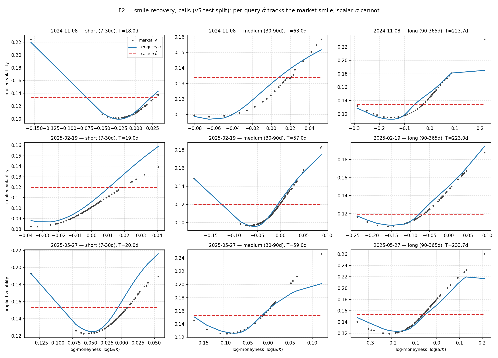
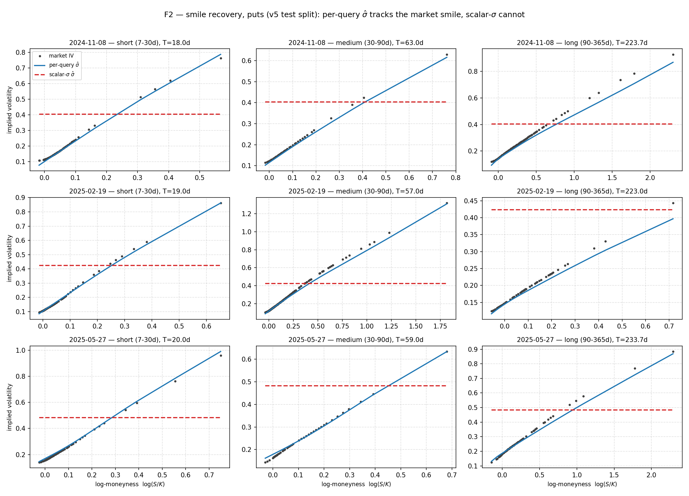
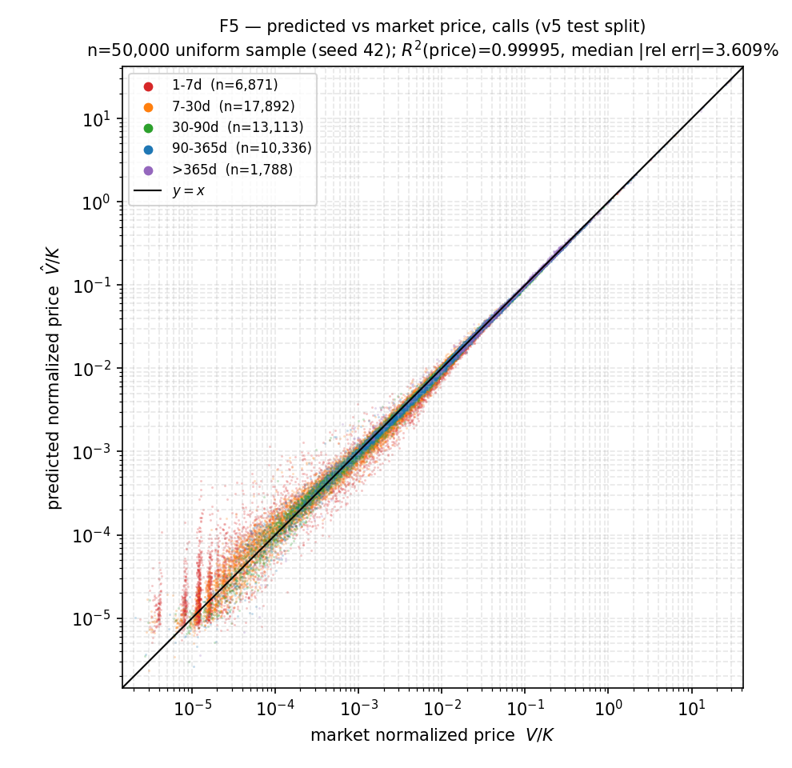
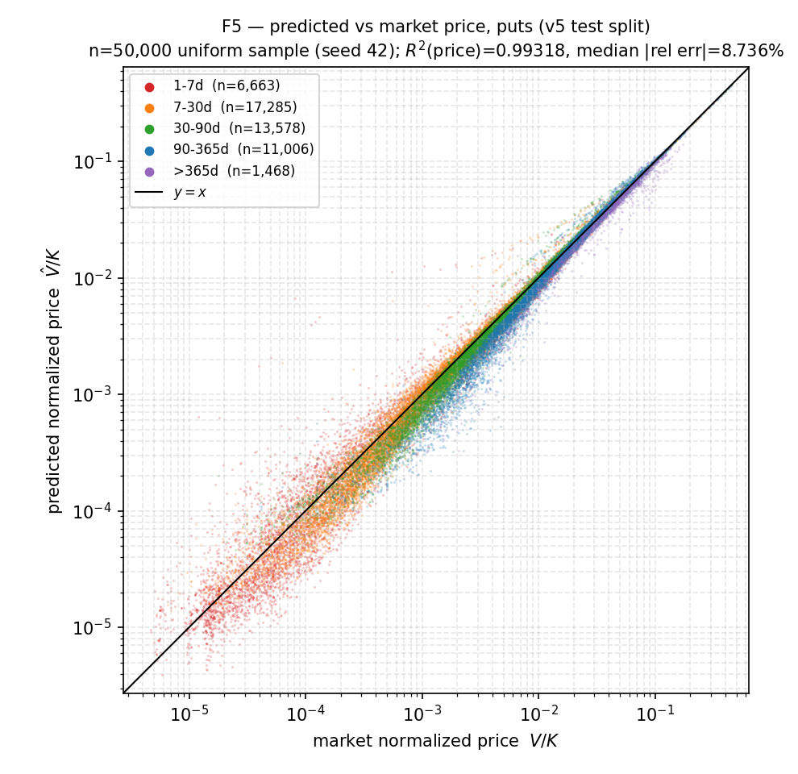
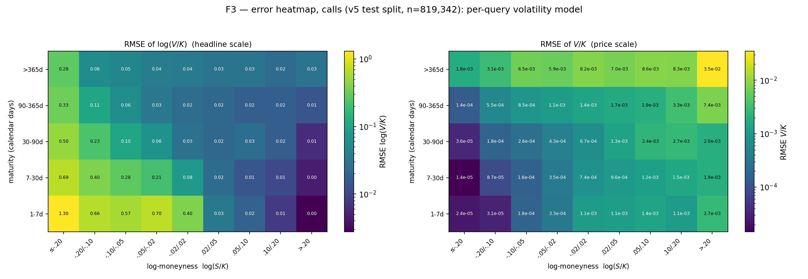
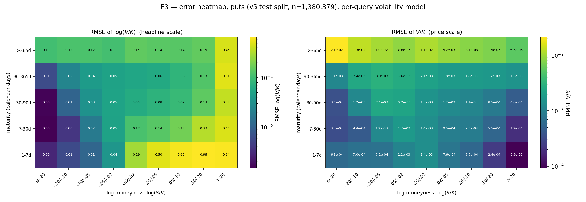

# Learning Implied Volatility, Not Prices: A Neural-Operator Encoder with a Differentiable Black–Scholes Decoder for Option Pricing

*Paper skeleton — drafted 2026-06-11, last brought current 2026-08-15. This document mirrors the
structure of `pub_plan.md` §2. Sections backed by current experimental results are written out;
sections that depend on artifacts not yet built (F1, F4, F6, related work, environment pinning) are
marked with explicit `> **TODO**` blocks. As of 2026-08-15 the full v5 experimental campaign is
**complete**: the 12-run canonical seed-42 matrix, the seed-43/44 replication of the four
`vol_surface` configs, the per-query-vs-scalar-σ ablation, the greeks derivative-consistency check,
and figures F2/F3/F5 have all been run — see the 2026-08-15 status note directly below and
`results/MANUSCRIPT_READINESS_INVENTORY.md` for the file-by-file provenance this section was written
from. Do not cite a number here that is not in a results file.*

---

## Status: what is backed by data vs. TODO

| Section | State |
|---|---|
| Method (§3) | ✅ Written from code / data contract |
| Data (§4) | ✅ v4 dataset built + validated 2026-08-12 (counts, splits, maturity rule, retained as unfiltered robustness sample); ✅ **v5 (quote-quality-filtered) built, validated (45/45 checks), and fully analyzed 2026-08-12/13 — canonical training sample**; v3 description kept, clearly labelled historical |
| Main results T1 — 12 core runs (§6) | ✅ **v5-trained, complete.** All 12 canonical seed-42 cells trained and evaluated by the independent evaluator (`analysis/eval_to_json.py` + `aggregate_results.py`) — `results/table_T1_v5.md` / `.tex` / `results/all_metrics_v5.csv`. Includes the corrected, genuine-CBOE-VIX `vix_history` runs (no longer VVIX). Not comparable to the historical v3 table (§4.1a, §6). |
| Replication (seeds 43/44) | ✅ Done for the four headline `vol_surface` cells only — `results/replication_seeds_v5.md`/`.csv`; `spot_history`/`vix_history` remain single-seed (explicitly, not silently) |
| Branch comparison, A-vs-B analysis (§6) | ✅ From v5 T1; vol_surface's advantage over spot/vix-history is confirmed robust across seeds; **A-vs-B architecture ranking is not established** (call ties, put-B-over-A rests on 3 seeds) — qualified below |
| Near-expiry tail analysis (§6) | ⚠️ Mechanism correction from 2026-08-11 stands (two mechanisms, not one) and is now moot for v5 itself — v5's maturity floor means `T ≤ 1 day` is empty by construction, so `R²(log,T>1day)` and `R²(log,full)` coincide on v5 (§6, F3). |
| Related work (§2) | ⬚ TODO — citations to gather |
| Baselines T2 — BS const-σ, IV interp (§5/§6) | ✅ `analysis/baselines.py` run on v3/v4/canonical-v5 test splits; ✅ **model-vs-baseline comparison now written up (§6, T2)** using the v5 T1 numbers against `results/baselines_v5.*`, now that a v5 model exists |
| Data quality / diagnostics (§4/§6) | ✅ v4 and canonical v5 (`results/{data_quality,diagnostics}_*_v5.*`, 2026-08-12/13): v5 has **zero** static-bound violations across every maturity/moneyness stratum for both option types, 0.00% duplicate inputs, T=0 ceiling not binding (`r2_log_full_ceiling=1.0`, `n_T0=0`) |
| Ablations T3 — per-query vs scalar σ̂ (§5.3/§6) | ✅ **Done.** `analysis/eval_ablation.py`, all 4 cells (`{call,put} × {per_query, scalar_sigma}`) — `results/ablation_scalar_sigma_v5.{md,csv,json}`. Decisive gap; put R²(price) goes negative under the scalar control. BS-vs-direct-regressor and MSE-vs-Huber ablations remain out of scope (§5.3, §7). |
| Greeks validation (§5.4/§6) | ✅ **Check executed** (not a figure — F6 remains TODO). `analysis/greeks_check.py` run on both v5-trained `vol_surface` A models — `results/greeks_check_{call,put}_v5.json`, agreement ~1e-14 to 1e-16 absolute. Confirms autograd-vs-closed-form BS-decoder consistency at fixed σ̂ only, not total system sensitivity (§1, §3.4). |
| Figures | ✅ F2 (smile recovery), F3 (error heatmap), F5 (pred-vs-market scatter), F7 (training curves) done and embedded (Appendix D). ⬚ F1 (architecture diagram), F4 (near-expiry SSE-vs-T tail), F6 (greeks-agreement figure) TODO. |
| Environment/dependency pinning (Appendix C) | ⬚ TODO |

> **2026-08-11 correction pass.** This revision corrects four claims that were wrong or overstated
> in the original draft: (1) "arbitrage-free by construction" → pointwise BS-consistency only
> (§1, §3.4, §8); (2) "exact greeks" → analytic BS partial greeks at fixed σ̂ (§1, §3.4, §8); (3) the
> near-expiry tail mechanism, previously attributed wholly to `T→0` ill-conditioning, is now split
> into exact-T=0 decoder degeneracy (dominant) and genuine small-T ill-conditioning (§6); (4) the
> call-vs-put R² framing was backwards — call price R² is the near-vacuous metric, put price R² is
> the informative one (§6). See inline notes at each location for what changed and why.
>
> **2026-08-12 — canonical dataset switches from v3 to v4; no model results yet on v4.** The v4
> preprocessing build (`wrds_data_2020-2025/deeponet_tensors_{call,put}_v4.h5`) completed and passed
> all 31 automated validation checks (§4). **v4 is now the canonical dataset for this paper.**
> ⚠️ **All neural R²/RMSE/MAE numbers in T1 (§6) and every "12 core runs" claim below are v3-trained
> and are historical, not current** — they predate v4 and must not be compared directly against any
> future v4 result, because v4 simultaneously changes (i) the maturity basis (settlement-aware, not
> `calendar_days/365`), (ii) the filtering (strict `>24h`, so the structurally-unfittable exact-`T=0`
> rows are gone), and (iii) contract identity (AM/PM settlement retained, collapsing the previously
> duplicated SPX/SPXW inputs from 17.8%/19.8% to 0.00%). All three move the metrics independently of
> any architecture change, which is why **all 12 core runs will be retrained on v4**, not only the
> 4 VIX ones — see §4 and §5.1. No v4 model has been trained as of this pass; do not infer or
> extrapolate v4 metrics from the v3 table.

> **2026-08-12 (later) — v4 CPU baselines/diagnostics/data-quality completed; no v4 model yet.**
> `analysis/baselines.py`, `analysis/data_quality.py`, and `analysis/diagnostics.py` have now run on
> the **full v4 test split** (call 840,493 rows / put 1,390,470 rows, 267 test dates, 2024-08-07 ..
> 2025-08-29), writing `results/{baselines_v4,data_quality_v4,data_quality_duplicates_v4,
> data_quality_bounds_v4,diagnostics_tail_v4,diagnostics_strata_v4,diagnostics_conditioning_v4}.*`.
> The v3 outputs (`results/baselines_vix.*`, `results/data_quality*.{json,csv}` without the `_v4`
> suffix) are preserved untouched as the historical record. Headline v4 findings, detailed in §4 and
> §6: (i) duplicate-input rows fall from 17.82%/19.81% (v3) to **0.00%** (v4, every row unique); (ii)
> the exact-`T=0` decoder degeneracy described in §6 is **structurally eliminated** — `n_T0 = 0`,
> `r2_log_full_ceiling = 1.0` for both option types, because v4's `>24h` maturity filter excludes it
> at export; (iii) static-bound violations drop from 4.36%/1.45% (v3) to 2.52%/0.73% (v4), with
> **zero** violations at `T ≤ 1 day` (v3 had 31–33% of violations there). **These are baselines and
> data diagnostics only — no v4 model has been trained.** Every neural R²/RMSE/MAE number in T1 (§6)
> remains v3-trained, historical, and explicitly pending retraining; do not infer or extrapolate any
> v4 model metric from the v4 baseline/diagnostic numbers below. One open item surfaced by the v4
> data-quality pass, not yet resolved: a handful of severe stale-quote outliers remain in the v4
> sample (call bound-violation depths up to 6.49 and 6.33 in `V/K` units, e.g. 2025-05-15 SPX
> Dec-2030 C400 with bid 13.0 / ask 5433.7) — a deterministic quote-quality filter is being evaluated
> separately and must be decided **before** the v4 training run (§4.1, §7).

> **2026-08-12 (later still) — quote-quality filter approved; v5 defined as the new canonical
> training target.** `analysis/quote_quality.py` evaluated a deterministic, zero-tolerance static
> no-arbitrage midpoint filter against the full v4 dataset (`results/QUOTE_QUALITY_REPORT.md`) and
> it has been **approved**: drop any row whose midpoint, in normalized `V/K` units, falls outside
> `[max(fwd−disc,0), fwd]` (calls) / `[max(disc−fwd,0), disc]` (puts) — `fwd = M·e^{−qT}`, `disc =
> e^{−rT}` — computed in float64 before the float32 HDF5 cast. This resolves the open item above.
> Measured on the float32 v4 export (**approximate** — the v5 float64 recomputation may shift these
> slightly, treat as provisional until the v5 build reports final counts): **call ~2.206%** removed
> (train 1.878% / val 3.324% / test 2.516%), **put ~0.822%** removed (train 0.881% / val 0.676% /
> test 0.726%); train-vs-test differential is small (+0.64 pp call, −0.16 pp put) — the reason this
> rule was chosen over spread-based alternatives, which shift 1.9–4.4× more of train than test
> (secular SPX quote-tightening 2015→2025) and would distort the evaluation distribution. See §4.1a
> for the full dataset-versioning consequence (v5) and §7 for the concentration disclosure.
>
> **2026-08-13 — v5 build, validation, and all three CPU analyses are COMPLETE.** This supersedes
> every "build in progress" / "not yet built" / "approximate, treat as provisional" qualifier
> attached to v5 above and in §4.1a. The v5 HDF5 build finished
> (`wrds_data_2020-2025/deeponet_tensors_{call,put}_v5.h5`) and passed **45/45 validation checks**
> (`VALIDATION_v5.json`: the 31 original v4-style checks plus 7 new v5-specific checks, ×2 option
> types), with **zero remaining static-bound violations, max gap 0.000e+00**. Final row counts (not
> the float32-approximate percentages quoted above, though those turned out to match to within
> ~0.001 pp):
>
> | | Call | Put |
> |---|---:|---:|
> | Total rows | 4,846,268 | 7,925,349 |
> | Train | 3,297,722 | 5,323,327 |
> | Validation | 729,204 | 1,221,643 |
> | Test | 819,342 | 1,380,379 |
> | Removed by filter | 2.2061% (109,324) | 0.8222% (65,705) |
>
> HDF5 SHA-256: call `ecf94de2996e3212ac791f944f847142e7a809c640b24cbd5989e8bdba801153`, put
> `46f3ee9d03d3423c6330c2b35a4d09893b0f538bdc046bc1018ebab79861c756`. Split date boundaries are
> **bit-identical to v4** (2128/266/267 dates, 2015-02-02 .. 2025-08-29) — the filter removed no
> trade date, only individual rows. `dataset_version="v5"`, `schema_version` stays `"v4"`. v4 files
> are preserved unchanged as the "unfiltered robustness sample; noncanonical for training" — re-hashed
> byte-identical to their original values (call
> `5f1c42aa2cc125fa0344b9e3d19fb374278aa629560c420c7ea4c76a6f910546`, put
> `2ba5b13b0beb374d86790b6fc94799ea92dbd057454fca4af86f357a1bafbd29`). `wrds_data_2020-2025/
> DATASET_MANIFEST.json` now exists and is populated as the single source of truth for dataset
> versions, paths, and hashes across the repo. `wrds_data_2020-2025/smoke_v5/` exists
> (`deeponet_tensors_{call,put}_v5_smoke.h5`) and is gate-verified — a real training script's
> `add_provenance()` was called against it directly and passed.
>
> **All three v5 CPU analyses are complete**, run on the full test split, no subsampling. *Data
> quality* (`results/data_quality_v5.json`): **zero static-bound violations across every maturity
> bucket (d=2–7 through d>365) and every moneyness bucket (M<0.8 through M>1.2), for both option
> types**; duplicate-input rate remains 0.00% (unchanged from v4). *Diagnostics*
> (`results/diagnostics_tail_v5.json`): the T=0 ceiling is still not binding — `n_T0=0`,
> `ceiling_binding=False`, `r2_log_full_ceiling=1.0` for both option types (unaffected, since the
> maturity floor is orthogonal to the quote filter). *Baselines* (`results/baselines_v5.{json,csv}`):
> best price-accurate baseline (R²(price)>0.99) by R²(log) — **call** `vix_level_scaled_pxfit` log-R²
> **+0.7904** (price 0.999809, vs v4's +0.8011 / 0.999802); **put** `surface_spline` log-R²
> **−2.5186** (price 0.996594, vs v4's −2.4688 / 0.997004). **These v5 numbers are slightly worse
> than v4's, and that is an understood, expected effect, not evidence of a problem or a data-quality
> regression:** the rows the filter removed carried roughly twice their row-share of total variance
> (call: −2.52% of rows but −5.16% of SST; put: −0.73% of rows but −1.41% of SST) — dropping the most
> extreme mispriced rows shrinks the R² denominator faster than the numerator, so v5 is a genuinely
> harder benchmark on the same metric than v4 was. State this whenever v4-vs-v5 baseline numbers are
> compared, so a reader does not misread the small decline as data quality regressing. The same
> scalar-VIX anti-inference caveat as v4 applies: `vix_level_*` baselines use the contemporaneous
> scalar VIX close, not the `vix_history` neural branch, and cannot be used to rank neural input
> branches against each other.
>
> **What remained pending as of 2026-08-13 — since resolved, see the note directly below.** At the
> time this paragraph was first written, no neural model had been trained on v4 or v5. That is no
> longer true (2026-08-15 note below); the paragraph is kept for the historical record of what was
> still open at this point in the project.

> **2026-08-15 — the full v5 experimental campaign is complete.** All GPU work flagged as pending
> above has now landed. Canonical reference for every number below:
> `results/MANUSCRIPT_READINESS_INVENTORY.md`.
> - **T1, 12/12 canonical seed-42 cells** — trained and evaluated by the independent evaluator
>   (`analysis/eval_to_json.py` + `analysis/aggregate_results.py`), including the corrected genuine-
>   CBOE-VIX `vix_history` runs. `results/table_T1_v5.md` / `.tex`, `results/all_metrics_v5.csv`
>   (commit `00897f6`).
> - **Seed-43/44 replication**, the four headline `vol_surface` cells (call/put × A/B) —
>   `results/replication_seeds_v5.md` / `.csv` (commit `d5410e5`, fixed for fake-zero SD in
>   `c6801b5`). `spot_history`/`vix_history` remain single-seed by design; their dispersion is
>   unmeasured, not zero.
> - **Per-query-vs-scalar-σ ablation**, all 4 cells — `results/ablation_scalar_sigma_v5.{md,csv,json}`,
>   run by `analysis/eval_ablation.py` (independent evaluator, not a `loss_history.txt` tail).
> - **Greeks derivative-consistency check**, both option types — `results/greeks_check_{call,put}_v5.json`
>   (+ paired `*_arrays_*.npz`), confirming autograd-vs-closed-form agreement at the predicted `σ̂`
>   to ~1e-14–1e-16 absolute error. This is the corrected "derivative consistency at fixed σ̂" claim,
>   not "exact greeks" (§1, §3.4).
> - **Figures F2 (smile recovery), F3 (error heatmap), F5 (predicted-vs-market scatter)** — built and
>   captioned (`results/fig_{F2,F3,F5}_*_v5.png` + `.md` captions), embedded in §6/Appendix D below.
>
> **Provenance discipline.** T1, the replication table, and the ablation table are all sourced from
> the independent evaluators (`eval_to_json.py`/`aggregate_results.py`/`eval_ablation.py`: full test
> split, fixed batch size, loaded from `best_model.pth`), not from a `loss_history.txt` training tail
> — the latter is explicitly preliminary and not citable (`results/MANUSCRIPT_READINESS_INVENTORY.md`
> §6). Trained weights (`*.pth`) are not committed to git; the committed artifacts are `config.json`,
> `metrics.json`, `loss_history.txt`, `loss_plot.png` per run.
>
> **What is still genuinely open** (unchanged by this note, see §7 for the full list): figures F1
> (architecture diagram), F4 (near-expiry
> SSE-vs-T tail), and F6 (a greeks-agreement *figure*, as opposed to the already-run greeks *check*)
> are not built; related-work citations (§2) and environment/dependency pinning (Appendix C) are not
> gathered; a surface-wide arbitrage violation-rate diagnostic remains queued, non-blocking work.

---

## Abstract

Most neural option pricers learn a map `(market state, contract) → price`. We instead learn a map
to a **per-contract implied volatility** `σ̂` and feed it through the **closed-form Black–Scholes
(BS) formula** to obtain the price. Because BS is built from differentiable primitives, gradients
flow from a plain data loss on `log(V/K)` back through BS into the network, so no neural surrogate
pricer is needed. This single architectural choice buys three properties for free: (i) no surrogate
approximation error — all error is attributable to `σ̂`; (ii) **analytic BS partial greeks** — every
reported greek is the closed-form BS greek at the predicted `σ̂`, holding `σ̂` fixed (not the total
sensitivity of the learned system, which would include a `dσ̂/dS · vega` term); (iii) **pointwise
Black–Scholes-consistent prices** — any `σ̂ ≥ 0` fed through BS respects the static, single-contract
no-arbitrage bounds, though this does not by itself guarantee calendar-spread or butterfly
consistency across the full predicted surface (an empirical violation-rate check on the surface is
queued work, §7). A 2-D Fourier Neural Operator (FNO) encodes the market state; a per-query head
(MLP or DeepONet branch·trunk) emits `σ̂` for each contract `(log-moneyness, T)`. On SPX options
(WRDS / OptionMetrics), trained on the canonical **v5** quote-quality-filtered dataset with a
no-leakage, date-based 80/10/10 split, the model reaches **R²(price) ≈ 0.9999–0.99998** and
**R²(log, T>1 day) ≈ 0.990–0.991** on the IV-surface input for calls (`results/table_T1_v5.md`) —
though the call price-R² figure sits close to a zero-parameter intrinsic-value baseline (0.9986,
`results/baselines_v5.json`) and is a near-vacuous metric on its own. The **put** comparison is more
discriminating but mixed across metrics: price-R² rises from 0.535 (zero-param) to 0.993–0.994
(model), while a fitted single-constant-σ baseline is actually *worse* than the zero-param floor
(R²(price) = −2.36, `results/baselines_v5.json`, `baseline="const_sigma"`); against the stronger
practitioner IV-surface-interpolation baseline (R²(price) = 0.997, `surface_spline`), the model's put
price-R² is a shade lower (0.993–0.994) but its put log-R² is decisively higher (0.978–0.981 vs
−2.52) — the two metrics disagree on which pricer wins, and both directions must be reported (§6).
Comparing market-state inputs, the implied-volatility surface prices best by a wide and consistent
margin over both SPX-history and (corrected, genuine-CBOE) VIX-history inputs: R²(log, T>1 day) sits
at ~0.98–0.99 for `vol_surface` versus ~0.90–0.94 for `spot_history`/`vix_history` on both option
types (`results/table_T1_v5.md`) — the earlier mislabeled-VIX (actually VVIX) issue is corrected and
this comparison is no longer pending (§4/§5.1).

---

## 1. Introduction

The pricing problem and the *learn-IV-vs-learn-price* dichotomy. Pricing an option is a map from
market state and contract terms to a price; the standard neural approach regresses that price (or
the implied vol) directly. We argue the price target is the wrong one: it forces the network to
re-learn the well-understood, closed-form dependence of price on volatility, time, and moneyness,
and it gives up structural guarantees. Instead we predict only the one genuinely hard quantity — a
per-contract implied volatility `σ̂` — and recover the price analytically.

**Why pointwise BS-consistency + analytic partial greeks matter.** A BS price for any `σ̂ ≥ 0`
exactly solves the BS PDE and respects the static, single-contract no-arbitrage bounds (e.g.
intrinsic-value and put-call bounds) **at that one queried `(K,T)`**, so the auxiliary PDE penalty
that physics-informed (PINN) approaches need is unnecessary at the single-contract level. This is
**not** the same as surface-wide arbitrage-freeness: because `σ̂` is fit independently per query,
nothing in the architecture guarantees calendar-spread or butterfly consistency *across* the
predicted `(K,T)` surface — that is an empirical property to be measured, not a corollary of the
decoder, and a violation-rate diagnostic on the predicted surface is queued work (§7). Separately,
every greek reported in this paper is the closed-form BS greek evaluated at the estimated `σ̂`,
**holding `σ̂` fixed** — an analytic partial greek, computed either in closed form or by autograd
through the decoder. This checks that autograd through the BS decoder agrees with the analytic BS
formula; it does **not** validate the total (sticky-strike) sensitivity of the learned system, which
would include a `dσ̂/dS · vega` term the frozen-`σ̂` check cannot see.

**Contributions (headline claims).**
1. Per-query `σ̂` recovers the volatility smile/skew that a single-scalar `σ̂` cannot.
2. Among market-state inputs (IV surface / SPX history / VIX history), we quantify which prices best
   — and by how much (§6, T1; all three legs done on v5, including the corrected genuine-CBOE-VIX
   `vix_history` runs).

The analytical-BS decoder additionally gives analytic partial greeks (verified in §5.4) and
pointwise BS-consistent prices (§3.4) — structural properties of the design. This paper makes no
claim about how it compares to a direct-price regressor of equal capacity: that control was never
run (§7).

> **Note on scope (keep while drafting):** this is an empirical / application paper. The core idea
> (differentiable BS layer, learning IV not price, analytical-pricer decoder) is sound but **not
> novel to the ML community**. Frame contributions as "a clean, carefully-evaluated study," not "a
> new method." Target: arXiv (`q-fin.CP` primary, `cs.LG` cross-list) + a finance/ML workshop.

---

## 2. Related work

> **TODO:** prose + citations for each cluster below.
> - Neural option pricing (direct price/IV regression).
> - PINNs in finance (PDE/arbitrage soft penalties) — position our structural alternative against
>   these, including our own superseded v1/v2 design.
> - Neural operators: FNO, DeepONet.
> - Classic IV-surface modeling: SVI, SSVI, splines (the practitioner baselines).

---

## 3. Method

### 3.1 The inverse IV problem
Given an observed normalized option price `V/K` for a contract with log-moneyness `log_m`, maturity
`T`, rate `r`, dividend yield `q`, the implied volatility `σ` is the value making BS reproduce the
price. We learn an estimator `σ̂` of this `σ` conditioned on the broader market state, and price
through BS. The target is `log(V/K)`. Two distinct effects make this inverse problem hard near
expiry, and §6 shows they are not the same size: (a) for genuinely small but positive `T`, the
inverse map `log(price) → σ` is ill-conditioned (`∂log(price)/∂σ` blows up near expiry/ATM); (b) for
contracts quoted **exactly** on their expiry date, preprocessing assigns `T_years =
calendar_days_to_expiry / 365 = 0` exactly, which is not an ill-conditioning problem at all but a
**decoder degeneracy** — the BS decoder returns intrinsic value independent of `σ̂` at `T = 0` (§6).
Both effects live in the near-expiry tail and are folded into the error analysis of §6, but they
have different causes and different fixes.

### 3.2 FNO market-state encoder
A 2-D Fourier Neural Operator: 4 `SpectralConv2d` blocks with 1×1-conv skip connections and SiLU
activations, `fno_width = 32`, flattened and projected to a 128-d latent (branch) vector. The 1-D
HDF5 market-state vector is reshaped to its 2-D grid inside the encoder. Three branch inputs, one
script each:

| input (branch_key) | grid | flat dim | modes |
|---|---|---|---|
| `branch_u` (implied-vol surface) | 11×17 | 187 | 4×8 |
| `spot_history` (21-day SPX OHLCV) | 21×5 | 105 | 6×2 |
| `vix_history` (21-day VIX OHLC) | 21×4 | 84 | 6×2 |

`vix_history` provenance note: the branch was originally trained (v3) on a mislabeled file that was
actually CBOE **VVIX** (vol-of-VIX, secid 152892), not VIX; those four v3 runs are quarantined
(`train_model_v3/_vix_is_vvix_LEGACY/`) and never cited. The v4/v5 preprocessing validates the
source CSV's SHA-256 and a `phase1_vix_source_series == "CBOE VIX"` field before training, and the
canonical v5 `vix_history` cells in T1 (§6) are trained on genuine Cboe VIX (§4, §5.1).

### 3.3 Per-query `σ̂` readouts
The same encoder feeds two interchangeable readouts (matched capacity, 128/128):
- **(A) MLP-head** (`train_*.py`): MLP on `[latent, log_m, T]` → softplus → `σ̂`.
- **(B) DeepONet** (`train_*_don.py`): FNO **branch** vector, MLP **trunk** on `(log_m, T)`;
  `σ̂ = softplus(⟨branch, trunk⟩ + sigma_bias) + sigma_floor`, with `sigma_bias` initialized to
  −1.50 (`σ̂ ≈ 0.20` at init) and `sigma_floor = 1e-6`.

`σ̂` is **per contract query**, not one scalar per market state — this is what lets the model fit the
smile/skew.

### 3.4 Differentiable Black–Scholes decoder
`bs_normalized_price(log_m, T, r, q, σ̂, option_type)` returns `V/K` from differentiable primitives
(`exp`, `erf`, `sqrt`). Gradients of the data loss flow through BS into the network. **Corollaries:**
(i) every reported greek is the **analytic BS partial greek at `σ̂`** — BS differentiated with `σ̂`
held fixed (verifiable by autograd vs closed-form, §6); this is not the total sensitivity of the
learned system, which would include a `dσ̂/dS · vega` term the frozen-`σ̂` check does not exercise;
(ii) the price is **pointwise Black–Scholes-consistent** for any `σ̂ ≥ 0` — it solves the BS PDE and
respects static no-arbitrage bounds at that one query, but this does not by itself guarantee
calendar-spread or butterfly consistency across the full predicted surface (queued diagnostic, §7).
There is **no** learned/neural pricer (that was the removed v1/v2 design).

One decoder property is worth flagging here because it drives the §6 tail analysis: the decoder
computes `sqrt_T = sqrt(clamp(T, 1e-10))`. Because preprocessing sets `T_years =
calendar_days_to_expiry / 365`, every contract quoted on its own expiry date gets **exactly** `T =
0`. At `T = 0` the decoder returns intrinsic value **for any `σ̂`** — vega is (numerically) zero and
the `1e-8` price clamp zeroes the loss gradient a second time. These rows are structurally
unfittable by construction (the decoder output does not depend on the quantity being learned), not
merely numerically hard; see §6 for the size of this effect.

### 3.5 Loss
Plain data MSE on `log(V/K)`. The default path uses `log(clamp(price, 1e-8))`. **No** PDE /
arbitrage / BS-anchor terms — they are redundant given the decoder. (`compute_loss` ships with MSE
active and `F.huber_loss(δ=1.0)` commented one line above as a deliberate toggle; Huber was tried
and reverted — stopped earlier, hurt R²(price), did not move R²(log).)

---

## 4. Data

WRDS / OptionMetrics **SPX** options (secid `108105`), European-style (BS applies directly),
covering **2015-02-02 to 2025-08-29** (the dataset directory is named `wrds_data_2020-2025` but
its date coverage starts in 2015 — confirmed from the `date` column). Filter `volume > 0`.

### 4.1 The v4 dataset (build completed 2026-08-12 09:14; now the unfiltered robustness sample — see §4.1a)

> **v4 was the canonical dataset when this build completed; it has since been superseded by v5
> (§4.1a, built + validated + analyzed 2026-08-12/13) as the canonical training sample.** v4 is now
> retained as the unfiltered robustness sample — its build facts below are unchanged and still
> accurate, they simply no longer describe the dataset this paper trains on. The v3 description in
> §4.2 below is kept for historical reference (it still backs every number in T1/§6) but is **not**
> the sample this paper will report on.

`wrds_data_2020-2025/deeponet_tensors_{call,put}_v4.h5` (8.06 GB / 13.00 GB), built from 43
quarterly parquet parts:

| | Call | Put |
|---|---:|---:|
| Total rows | 4,955,592 | 7,991,054 |
| Train | 3,360,823 | 5,370,629 |
| Validation | 754,276 | 1,229,955 |
| Test | 840,493 | 1,390,470 |
| Unique dates | 2,661 | 2,661 |

Coverage 2015-02-02 .. 2025-08-29; last train date 2023-07-17; last validation date 2024-08-06.
HDF5 SHA-256 (abbreviated): call `5f1c42aa…10546`, put `2ba5b13b…bd29` — full hashes are recorded
in `wrds_data_2020-2025/VALIDATION_v4.json`; cite that file rather than a hash quoted here. Source
VIX CSV SHA-256 (full): `e2f18c516c9d48fb1730c2c0203fce36900c70aa0635b99e64afdde157346301`.
**Validation: all 31 checks passed** (`wrds_data_2020-2025/validate_v4.py` → `VALIDATION_v4.json`),
covering finite values, time-ordered non-overlapping splits by unique date, zero duplicate model
inputs, genuine VIX levels, and direct raw-VIX-to-HDF5 matches.

**Maturity definition (decided point).** The canonical cutoff is `--min-maturity-days 1.0` on the
**settlement-aware** maturity. The sample is: contracts with strictly more than 24 hours remaining
to settlement. The observed minimum maturity is **1.729 days**, which is expected, not an anomaly:
quotes are end-of-day, and AM-settled (SPX) contracts settle at the 09:30 ET opening print, losing
a further 6.5 hours, so a 2-calendar-day AM contract is 2 − 6.5/24 = 1.729 days. PM-settled (SPXW)
contracts bottom out at exactly 2.000 days, because a 1-calendar-day PM contract is exactly 1.0 day
and is excluded by the strict `>`. A separately-named `T > 0` diagnostic export for a near-expiry
sensitivity analysis is possible future work, but must never replace this canonical sample.

Each `deeponet_tensors_{call,put}_v4.h5` keeps every v3 dataset name, shape, dtype, and row
alignment (`branch_u`, `spot_history`, `vix_history`, `trunk_y = [log_moneyness, T_years, r, q]`,
`target_v_log = log(mid/K)`, `moneyness`, `normalized_price`, `date`, `split_id`), and adds new
fields alongside (`symbol`, `optionid`, `root`, `am_settlement`, `exercise_style`,
`impl_volatility`, market delta, `best_bid`, `best_offer`, `spread_norm`, `half_spread_norm`,
`strike`, `T_calendar`, `T_settlement`, `vix_level`). The 80/10/10 split remains by unique trade
date, not by row.

### 4.1a The v5 dataset: quote-quality-filtered v4 (built, validated, and analyzed 2026-08-12/13 — canonical)

`analysis/quote_quality.py` swept the full v4 dataset (both option types, all three splits, no
subsampling) for midpoints inconsistent with the static Black–Scholes no-arbitrage bounds. In
normalized `V/K` units, with `fwd = M·e^{−qT}` and `disc = e^{−rT}`, calls must lie in
`[max(fwd−disc, 0), fwd]` and puts in `[max(disc−fwd, 0), disc]`; every violation found across the
full dataset is a **lower-bound** violation (mid below intrinsic), all computed in float64 before
the float32 HDF5 cast. Full evidence, sensitivity table, and worked examples are in
`results/QUOTE_QUALITY_REPORT.md`.

**The filter is approved and zero-tolerance (`tol = 0`).** Measured on the float32 v4 export —
described as **approximate** here because the float64 recomputation for the actual v5 build may
shift these slightly:

| | call | put |
|---|---|---|
| total removed | ~2.206% (109,323 / 4,955,592) | ~0.822% (65,705 / 7,991,054) |
| train | ~1.878% | ~0.881% |
| val | ~3.324% | ~0.676% |
| test | ~2.516% | ~0.726% |
| test − train (pp) | +0.64 | −0.16 |

Spread-based rules (`best_bid ≤ 0`, relative spread thresholds) were evaluated and **rejected**:
they catch a nearly disjoint set of rows (`rel.spread > 1 ∩ out-of-bounds` is 16 of 109,323 call
violations — spread rules are blind to tight-but-stale two-sided quotes, e.g. a 2022-01-25 deep-ITM
LEAPS quoted 3802.50/3994.50, relative spread 0.049, still 0.671 below intrinsic), and they remove
1.9–4.4× more of train than of test, reflecting a real secular tightening of SPX quotes from 2015 to
2025 — using such a rule would shift the evaluation distribution relative to training. The bound
filter's train/test differential is negligible by comparison (above).

**Removal is not uniform — disclose the concentration, not just the headline.** By moneyness:
~34% of the deep-ITM call bucket (`M > 1.2`) and ~39% of the deep-OTM put bucket (`M < 0.8`) are
removed; by maturity, ~11.6% of the 2–7-day call bucket. However, those buckets are small shares of
their option type (`M>1.2` is 2.06% of all calls, 102,286 rows; `M<0.8` is 0.30% of all puts, 24,305
rows), and the largest **absolute** contributors to the removed count are moderately-ITM calls
(`1.05–1.2`, 42,384 rows) and near-ATM calls (32,065 rows) — the removal is concentrated in relative
terms but diffuse in absolute terms. Both facts must be reported together; neither alone is the
whole picture.

**Corroborating, not independent, cross-check.** ~98% of bound violations also carry a NULL vendor
`impl_volatility`. This is not a second, independent confirmation: OptionMetrics' own IV inversion
fails *because* it operates on the same inconsistent midpoint and carry inputs the bound arithmetic
flags — it is the same evidence observed twice, not two witnesses. It is retained here only as a
sanity check that the rule tracks something the vendor's own pipeline also fails on, not as
corroborating statistical independence.

**Scope of the claim.** The filter removes midpoints **inconsistent with the static no-arbitrage
bounds under the supplied spot, rate, dividend-yield, and settlement inputs** — `r`, `q`, and the
settlement timestamp are themselves estimates in this dataset, not observed riskless-rate trades, so
this is a claim about the BS decoder's inability to reach these prices at *any* σ̂ given those
inputs, not a claim that a riskless market arbitrage actually existed. Avoid "provable market
arbitrage" or "provably unfittable" without this qualification.

**A `tol = 1e-3` variant was considered and not chosen.** It cuts removal ~5× (call 0.437%, put
0.100%) and still eliminates every pathological outlier (the depth-6+ rows), but introduces a tuned
constant the zero-tolerance rule avoids. It is recorded as the documented fallback in the
sensitivity table (`results/QUOTE_QUALITY_REPORT.md` §4).

**Dataset versioning.** The filtered sample is a new dataset version, **v5**:
`schema_version` remains `"v4"` (the tensor schema — names, shapes, dtypes, columns — is unchanged),
but a new, independent attribute `dataset_version = "v5"` is added (the *sample definition*
changed). Files: `wrds_data_2020-2025/deeponet_tensors_{call,put}_v5.h5`. **The unfiltered v4 files
are retained**, relabeled *"unfiltered robustness sample; noncanonical for training"* — not
invalid, and kept explicitly for a robustness check against v5. **All 12 core training runs will
target v5**, not v4 — the build is complete (see the 2026-08-13 note above for final row counts and
hashes); only the GPU training itself remains. `wrds_data_2020-2025/DATASET_MANIFEST.json` now
exists and is populated as the single source of truth for dataset versions, paths, and hashes
across the repo.

A **quote-liquidity stratification** (`best_bid > 0` and relative spread ≤ 1) is being added
alongside v5 as *reporting strata only* — so the manuscript can show a v5-trained model's results
are not driven by the zero-bid / wide-spread quotes v5 still retains. This is explicitly **not** a
second filter; adopting it as a filter would require a separate decision.

**Precedent.** Excluding OptionMetrics observations that violate static no-arbitrage conditions has
precedent in the literature (Buechner & Kelly, NBER w29369; Cohen, Reisinger & Wang,
arXiv:2008.09454 — the latter also cautions that filtering discards information). Cited here as
precedent/caveat only; no specific numerical result from either source is claimed.

> **Status (2026-08-13): built, validated, and analyzed — complete.** The v5 HDF5 build, its
> validation (`VALIDATION_v5.json`, **45/45 checks passed**, zero remaining static-bound violations),
> and the v5 re-runs of `analysis/baselines.py` / `analysis/diagnostics.py` / `analysis/data_quality.py`
> are **done** — see the 2026-08-13 correction note at the top of this document for final row counts,
> hashes, and results, and `wrds_data_2020-2025/DATASET_MANIFEST.json` for the canonical version/path/
> hash record.
>
> **Status (2026-08-15): the 12 core model runs are trained on v5 — complete.** All 12 canonical
> seed-42 cells are trained and evaluated by the independent evaluator; `results/table_T1_v5.md` /
> `.tex` replaces the v3-historical T1 table in §6 below. See the 2026-08-15 note near the top of
> this document and `results/MANUSCRIPT_READINESS_INVENTORY.md` for the full campaign summary
> (replication, ablation, greeks check, figures).

### 4.2 v3 description (historical — backs T1/§6 only)

Each `deeponet_tensors_{call,put}.h5` (v3) holds row-aligned datasets: the three branch
inputs (`branch_u`, `spot_history`, `vix_history`); trunk `trunk_y = [log_moneyness, T_years, r, q]`;
target `target_v_log = log(mid/K)`; and `moneyness`, `normalized_price`, `date`, `split_id`.

**Branch-input provenance correction (2026-08-11).** The original `vix_history` branch was built
from a mislabeled CSV that was actually CBOE **VVIX** — the volatility of VIX (secid `152892`,
ticker `VVIX`, columns `open/high/low/close`) — not VIX. The v4 preprocessing
(`wrds_data_2020-2025/`) replaces it with genuine wide-format Cboe SPX VIX (`vixo`/`vixh`/`vixl`/`vix`,
SHA-256 `E2F18C51…6301`). All four `vix_history` **v3** model runs trained on the old file are VVIX
artifacts, quarantined at `train_model_v3/_vix_is_vvix_LEGACY/`, and their numbers must never be cited
as VIX results. **Resolved 2026-08-15:** the four `vix_history` cells retrained on v5 use genuine
Cboe VIX and are reported in T1 (§6); only the v3-era VVIX runs remain quarantined.

**No-leakage split.** The 80/10/10 train/val/test split is **by unique trade date**, not by row — a
deliberate time-ordered split that prevents same-day leakage across splits.

**Test-split sizes** (from eval): call ≈ **905,029** contracts, put ≈ **1,462,668** contracts. The
near-expiry tail `T ≤ 1 day` removed by the headline filter is ~68,443 calls (~7.6%) and ~78,187
puts (~5.3%). ⚠️ v3's `T > 1/365` filter did **not** actually exclude 1-day contracts —
`float32(1/365)` rounds above the true value, so it only ever dropped exact `T = 0`. v4's strict
`>24h` filter genuinely excludes everything at or below 24 hours, which is why v4's `T > 1/365`
filter (§4.1) is a no-op — on v4, "headline" and "full-domain" `R²(log)` are the same number. Do
**not** re-cut v4 to imitate the v3 float32 rounding accident; that would weaken the methodology.

> **Resolved 2026-08-12:** whether per-contract observed IV can be recovered for the smile figure
> F2 — `analysis/baselines.py` now inverts `normalized_price` via vectorised bisection on the v4
> sample and cross-checks it against the stored OptionMetrics `impl_volatility`: combined coverage
> 97.54% (call) / 99.28% (put), median disagreement between the two sources 1.7e-5 (call) / 1.4e-5
> (put) — F2 can be built from this. **Resolved 2026-08-12/13:** baselines/diagnostics/data-quality
> analyses have been re-run on both the v4 sample and the canonical v5 sample — see §5.2 and §6 for
> the numbers. **Resolved 2026-08-15:** the 12 core model runs are trained on v5 (§4.1a, §5.1) — the
> full experimental campaign for this paper is complete; see the 2026-08-15 note near the top of this
> document.

### 4.3 Retention / row counts across the pipeline

Compiled from `wrds_data_2020-2025/VALIDATION_v4.json`, `VALIDATION_v5.json` and
`DATASET_MANIFEST.json` (no new computation; percentages are `(v4 − v5) / v4`).

**Stage 1 — phase-1 parquet.** `deeponet_training_data_parts_v4/` holds **13,595,211** rows in 43
parts, both option types combined, *before* the maturity cut (`VALIDATION_{v4,v5}.json`,
`parquet_rows_all_types`). Phase 2 then splits by `cp_flag` and applies the required-column
null-drop, the `vol_surface_vector` length check and the `--min-maturity-days 1.0` settlement-aware
maturity cut, yielding the v4 HDF5 row counts below (12,946,646 call+put, i.e. 648,565 parquet rows
did not survive phase 2).

**Stage 2 — v4 (unfiltered) → v5 (quote-quality filtered).** The zero-tolerance static
no-arbitrage midpoint filter (§4.1a, `results/QUOTE_QUALITY_REPORT.md`) removes rows only; all
2128/266/267 split dates are preserved bit-identically.

| option | split | v4 rows | v5 rows | removed | removed % |
|---|---|---:|---:|---:|---:|
| call | train | 3,360,823 | 3,297,722 | 63,101 | 1.878% |
| call | validation | 754,276 | 729,204 | 25,072 | 3.324% |
| call | test | 840,493 | 819,342 | 21,151 | 2.516% |
| call | **total** | **4,955,592** | **4,846,268** | **109,324** | **2.206%** |
| put | train | 5,370,629 | 5,323,327 | 47,302 | 0.881% |
| put | validation | 1,229,955 | 1,221,643 | 8,312 | 0.676% |
| put | test | 1,390,470 | 1,380,379 | 10,091 | 0.726% |
| put | **total** | **7,991,054** | **7,925,349** | **65,705** | **0.822%** |

Split dates are identical in v4 and v5: train 2,128 dates (2015-02-02 … 2023-07-17), validation 266
(2023-07-18 … 2024-08-06), test 267 (2024-08-07 … 2025-08-29). The train-vs-test removal
differential is small (+0.64 pp call, −0.16 pp put), which is why this rule was preferred over
spread-based alternatives that shift 1.9–4.4× more of train than test (§4.1a).

> **Still TODO (one stage only):** the *raw* OptionMetrics CSV row count and the per-rule attrition
> inside phase 1 (secid/index filters, date-range cut, VIX/spot join losses) are not recorded in any
> committed artifact — only the post-phase-1 parquet total (13,595,211) and the 648,565-row phase-2
> attrition are, and the latter is not itself broken down by cause (null-drop vs surface-length vs
> maturity cut). Filling this in requires re-scanning the raw CSVs, which is new computation and was
> deliberately not run for this table.

---

## 5. Experiments

### 5.1 Core model runs — 12 total, all done on v5 (2026-08-15)
`{call, put} × {vol_surface, spot_history, vix_history} × {MLP-head (A), DeepONet (B)}`, trained on
the canonical **v5** dataset (§4.1a). Shared config (identical across all runs): two-phase training —
Adam (`epochs=100`, `lr=1e-3`, `ReduceLROnPlateau`) then fine-tune (`epochs=50`, `lr=1e-5`);
`batch_size=256`, `grad_clip=1.0`, patience 5 each phase, `min_finetune_epochs=10`, seed 42; early
stop on val MSE. Metrics on the **test split**: R²(price), R²(log, full), **R²(log, T>1 day)
(headline)**, RMSE(log), RMSE(price), MAE(price), computed by the independent evaluator
(`analysis/eval_to_json.py`, full test split, fixed batch size, loaded from `best_model.pth`) and
aggregated by `analysis/aggregate_results.py` into `results/table_T1_v5.md` / `.tex` /
`results/all_metrics_v5.csv`. All price metrics are on **normalized price `V/K`** (not raw dollars).
Weights (`*.pth`) are not committed to git (`.gitignore`); reproduction requires the local
`train_model_v3/{call,put}/results_{vol_surface,spot_history,vix_history}[_don]_v5/` directories.

**`vix_history` runs: corrected and complete.** The mislabeled-VIX (actually VVIX, secid 152892)
issue described below (§4.2) is fixed in the v4/v5 preprocessing, which validates the source CSV's
SHA-256 and a `phase1_vix_source_series == "CBOE VIX"` provenance field before allowing training; the
four `vix_history` v5 cells (call/put × A/B) in T1 (§6) are trained on genuine Cboe VIX. The four
VVIX-trained v3 runs remain quarantined under `train_model_v3/_vix_is_vvix_LEGACY/` and are never
cited as VIX results (§4.2).

**Seed-43/44 replication.** The four headline `vol_surface` cells (call/put × A/B) were additionally
trained at seeds 43 and 44 — `results/replication_seeds_v5.md` / `.csv` — to give the A-vs-B and
branch-comparison claims in §6 a dispersion estimate. `spot_history`/`vix_history` remain single-seed
(seed 42 only); their run-to-run dispersion is unmeasured, not zero, and no variance figure should be
implied for them.

### 5.2 Baselines (run on the v3, v4, and canonical v5 test splits)
> **Status (2026-08-12, v3 run):** `analysis/baselines.py` **has been written and executed** on the
> full v3 test split (call n=905,029 / put n=1,462,668); results are in `results/baselines_vix.json`
> and `results/baselines_vix.csv`, with a run log in `results/baselines_vix_run.log`. It reproduced
> the independently-computed reference values (call R²(price) 0.999856, put 0.997201 vs 0.997208 for
> IV-surface interpolation), so the numbers below marked "reviewer-supplied" are confirmed in-repo.
>
> **Status (2026-08-12, v4 run):** the same script has now also
> run on the **full v4 test split** (call 840,493 rows / put 1,390,470 rows, 267 test dates,
> 2024-08-07 .. 2025-08-29) → `results/baselines_v4.json` / `results/baselines_v4.csv`. The v4 sample
> has **settlement-aware maturity (no T=0 rows) and no duplicate contract inputs**. Key
> v4 results (see the full table below and §6 for interpretation rules):
> - **Calls, by R²(log):** `vix_level_scaled_pxfit` **+0.8011** (price R² 0.999802);
>   `vix_level_scaled` +0.7974 (0.999796); `surface_spline` +0.7764 (**best call price-R²,
>   0.999852**); `surface_bilinear` +0.7763; `surface_nearest` +0.7751; `prev_day_surface_bilinear`
>   +0.7395; `intrinsic_zero_vol` −15.8866 (0.999449).
> - **Puts, by R²(log):** `vix_level_scaled` is least-negative at **−0.3336** but has a strongly negative
>   price-R² of **−3.245063**; `const_sigma` −0.3665 (price −1.920967); `surface_spline` −2.4688 with
>   the **best price-accurate result, price-R² +0.997004**; `intrinsic_zero_vol` −33.7053 (0.602701).
>   Any "best baseline" claim on puts must carry both metrics — log-R² and price-R² rank the
>   baselines in opposite orders here.
> - **Interpretation caveat (do not skip):** `vix_level_*` uses the **contemporaneous scalar VIX
>   close** (one number per date) — a *contemporaneous scalar volatility benchmark*, not a
>   maturity-matched option IV. It says nothing about the `vix_history` **neural branch**, which is a
>   21-day×4 OHLC tensor, close-normalized so the absolute VIX level is destroyed — a different input
>   with different information content. Do not read the scalar-VIX baseline ranking as evidence about
>   how the `vix_history` branch would compare to `vol_surface` or `spot_history`.
>
> **Status (2026-08-12/13, v5 run — now the canonical run for this paper):** `analysis/baselines.py`
> has also run on the **full canonical v5 test split** (call 819,342 rows / put 1,380,379 rows) →
> `results/baselines_v5.json` / `results/baselines_v5.csv`. This is the version of T2 that belongs in
> the paper once a v5-trained model exists to compare against it. Best price-accurate baseline
> (R²(price)>0.99) by R²(log): **call** `vix_level_scaled_pxfit` **+0.7904** (price 0.999809, vs v4's
> +0.8011/0.999802); **put** `surface_spline` **−2.5186** (price 0.996594, vs v4's
> −2.4688/0.997004). The v5 numbers are slightly worse than v4's on both option types — this is
> expected, not a data-quality regression: the rows the quote-quality filter removed carried roughly
> twice their row-share of total variance (call −2.52% of rows / −5.16% of SST; put −0.73% of rows /
> −1.41% of SST), so removing them shrinks the R² denominator faster than the numerator, making v5 a
> genuinely harder benchmark on the same metric. Any v4-vs-v5 baseline comparison must state this
> explicitly. The same scalar-VIX interpretation caveat above applies unchanged to the v5 numbers.
>
> **Two caveats that still apply.** (i) The v3 numbers above and in §6 are on the **v3** sample
> (calendar-day maturity, T=0 rows present, AM/PM settlement collapsed) — kept as the historical
> record, not superseded, but not the sample this paper reports on; v4 similarly is now retained only
> as the unfiltered robustness sample, not the canonical one. (ii) The VIX baselines are against
> genuine Cboe VIX in the v3, v4, and v5 runs; the superseded VVIX-based run is archived at
> `results/baselines_vvix_legacy.{json,csv}` and is not evidence about VIX.
> - **BS constant-σ:** price each test contract with a single daily σ — (i) ATM IV of the day,
>   (ii) VIX — then BS. Establishes the value added by a per-query surface.
> - **Classic IV interpolation:** σ per query from the observed 11×17 surface via 2-D spline /
>   bilinear, nearest-neighbor, and optionally an SVI slice fit per date; then BS. The standard
>   practitioner baseline the model must beat.
> - **Zero-parameter baseline (reviewer-supplied, new):** intrinsic value for calls / zero-vol price
>   for puts (i.e. `σ̂ = 0` fed through BS), no fitted parameters at all. Included because it turns
>   out to be a surprisingly strong call-price baseline (§6) — R²(price) alone is not sufficient to
>   show the model learned anything on the call side without this floor for comparison.

### 5.3 Ablations — per-query σ̂ vs single-scalar σ̂ (done, 2026-08-15)
`analysis/eval_ablation.py`, all 4 cells (`{call, put} × {per_query, scalar_sigma}`), v5, seed 42,
`vol_surface` branch, independent evaluator (full test split, fixed batch size — canonical, not a
`loss_history.txt` tail) — `results/ablation_scalar_sigma_v5.{md,csv,json}`. The `scalar_sigma`
variant removes per-contract conditioning: `σ̂` comes from the market-state latent alone (flat-vol
BS, no smile/skew), everything else held equal (encoder, decoder, training schedule).

| option | variant | R²(price) | R²(log, T>1day) | RMSE(log) |
|---|---|---|---|---|
| call | per_query | 0.999977 | 0.991044 | 0.221896 |
| call | scalar_sigma | 0.999825 | 0.800103 | 1.048319 |
| put | per_query | 0.992553 | 0.977899 | 0.294127 |
| put | scalar_sigma | −3.090190 | −0.316871 | 2.270415 |

Removing per-contract conditioning drops call R²(log, T>1day) 0.991 → 0.800 and put R²(log, T>1day)
0.978 → **−0.317**; on price-space the put effect is starker still, R²(price) 0.993 → **−3.090**
(worse than predicting the mean price). The scalar control is not part of T1 (§6) — it is a
restricted architecture used only to isolate the value of per-query conditioning, not a candidate
model.

**F2 — smile recovery (v5 test split), the visual counterpart of this ablation:**

Three fixed test dates (25th/50th/75th percentile of the date axis, chosen by rank only) × three
maturity buckets (short 7–30d, medium 30–90d, long 90–365d), plotting market IV, the per-query
`σ̂(latent, log m, T)`, and the scalar-σ `σ̂(latent)` (`results/fig_F2_smile_recovery_v5.md`). The
per-query curve tracks the observed smile/skew across moneyness in every panel (e.g. put,
2025-02-19, medium bucket: per-query σ̂ ranges [0.088, 1.310] against a market IV range of
[0.104, 1.320], both far from flat); the scalar-σ curve is, by construction, a single horizontal
value per panel (e.g. 0.1196 for that same call date, 0.4238 for that put date) — the figure script
asserts zero within-panel range for it. This is exactly the gap the ablation table quantifies.

*(b)* BS-decoder vs direct-price regressor of equal capacity, *(c)* MSE vs Huber, and *(d)* near-expiry
exclusion/down-weighting remain out of scope for this preprint (§7) — Huber was tried informally and
reverted (§3.5) but not run as a controlled ablation.

### 5.4 Greeks validation — done (2026-08-15)
`analysis/greeks_check.py` executed on the v5-trained `vol_surface` arch-A models (`results/
greeks_check_call_v5.json`, `results/greeks_check_put_v5.json`, `n_sampled=2000` each). It computes
autograd `∂price/∂S` (delta) and vega through the BS decoder and compares them to the closed-form BS
expressions at the same fixed predicted `σ̂`:

| option | delta max abs diff | delta median abs diff | vega max abs diff | vega median abs diff |
|---|---|---|---|---|
| call | 1.84e-14 | 1.40e-16 | 1.38e-15 | 5.55e-17 |
| put | 1.43e-14 | 8.37e-17 | 2.12e-15 | 5.55e-17 |

Agreement is at float64 machine precision, as expected for two mathematically identical expressions
evaluated by autograd vs closed form. As both `greeks_check_*.json` files' own `checks` field and the
script's header state, this confirms **BS-decoder derivative consistency at the fixed predicted `σ̂`**
— it is **not** an independent oracle and does **not** check the total (sticky-strike) sensitivity of
the learned system, which would include a `dσ̂/dS · vega` term the frozen-`σ̂` check cannot see (§1,
§3.4). F6, a plotted version of this agreement, remains TODO (Appendix D).

---

## 6. Results & analysis

### T1 — Main results (12 core runs, canonical **v5**, seed 42, test split)

All 12 cells trained and evaluated on the canonical v5 dataset (§4.1a); source
`results/table_T1_v5.md` / `.tex` / `results/all_metrics_v5.csv`, produced by the independent
evaluator (`analysis/eval_to_json.py` + `analysis/aggregate_results.py`), not a `loss_history.txt`
tail. On v5 there are zero `T ≤ 1 day` rows in the test split by construction (§4.1), so
**R²(log, T>1day) and R²(log, full) are numerically identical** — the table below shows only one
column for both, unlike the historical v3 table (kept below for the record).

| option | branch | arch | R²(price) | R²(log, T>1day = full) | RMSE(log) | RMSE(price) | MAE(price) |
|---|---|---|---|---|---|---|---|
| call | vol_surface  | A | 0.999977 | **0.991044** | 0.221894 | 0.002168 | 0.000641 |
| call | vol_surface  | B | 0.999914 | 0.990290 | 0.231041 | 0.004189 | 0.000739 |
| call | spot_history | A | 0.999812 | 0.922020 | 0.654761 | 0.006190 | 0.003569 |
| call | spot_history | B | 0.999181 | 0.944390 | 0.552923 | 0.012911 | 0.002769 |
| call | vix_history  | A | 0.999848 | 0.921333 | 0.657639 | 0.005559 | 0.003114 |
| call | vix_history  | B | 0.998125 | 0.939874 | 0.574940 | 0.019537 | 0.002985 |
| put  | vol_surface  | A | 0.992553 | **0.977898** | 0.294136 | 0.001924 | 0.000823 |
| put  | vol_surface  | B | 0.993780 | 0.981298 | 0.270566 | 0.001758 | 0.000659 |
| put  | spot_history | A | 0.952078 | 0.909410 | 0.595489 | 0.004880 | 0.002484 |
| put  | spot_history | B | 0.942330 | 0.901553 | 0.620777 | 0.005353 | 0.002847 |
| put  | vix_history  | A | 0.962518 | 0.920722 | 0.557070 | 0.004315 | 0.002429 |
| put  | vix_history  | B | 0.961502 | 0.917777 | 0.567323 | 0.004374 | 0.002477 |

*`vix_history` rows are now genuine Cboe VIX (v4/v5 preprocessing validates the source CSV's SHA-256
and a `phase1_vix_source_series == "CBOE VIX"` provenance field before allowing training, §5.1); the
old VVIX-trained v3 figures below are superseded, not reused.*

**Replication (seeds 42/43/44), the four headline `vol_surface` cells** —
`results/replication_seeds_v5.md`:

| option | arch | R²(price) mean±SD | R²(log, T>1day) mean±SD | RMSE(log) mean±SD |
|---|---|---|---|---|
| call | A | 0.999972 ± 0.000005 | 0.990996 ± 0.000073 | 0.222493 ± 0.000896 |
| call | B | 0.999865 ± 0.000131 | 0.991075 ± 0.000716 | 0.221388 ± 0.008838 |
| put | A | 0.994660 ± 0.001898 | 0.979099 ± 0.001424 | 0.285924 ± 0.009813 |
| put | B | 0.995392 ± 0.001403 | 0.981738 ± 0.000611 | 0.267345 ± 0.004491 |

`spot_history`/`vix_history` remain single-seed (seed 42 only) — no variance figure exists or should
be implied for those 8 cells.

**Branch comparison (headline claim 3 — now fully testable, VIX no longer suspended).** The ranking
is consistent across both option types and both architectures, all 12 cells done: **`vol_surface` ≫
`spot_history` ≈ `vix_history`** on R²(log, T>1 day) — calls **.990–.991** vs .922–.944 (spot) /
.921–.940 (vix); puts **.978–.981** vs .902–.909 (spot) / .918–.921 (vix). Replication confirms this
gap is robust to seed variation: e.g. call vol_surface A's across-seed SD (0.000073) is roughly three
orders of magnitude smaller than its gap to spot_history A (0.991 − 0.922 ≈ 0.07); other
cell/metric pairs give a smaller but still decisive ratio (roughly 40× at the low end) — report the
range, not a single flat "two orders of magnitude" figure. `spot_history` and `vix_history` are close
to each other on both option types — a contemporaneous IV surface clearly carries more pricing signal
than either historical-price input, but historical SPX prices and historical VIX levels carry
similar, more limited amounts of it.

**A vs B — architecture ranking not established.** On `vol_surface`, call A and B are effectively
tied across seeds (R²(log) 0.990996 ± 0.000073 vs 0.991075 ± 0.000716, overlapping within ~1 SD);
put B looks somewhat better than put A (0.981738 ± 0.000611 vs 0.979099 ± 0.001424), but that
reading rests on only 3 seeds and is not a strong superiority claim. Treat any "architecture A/B is
better" statement as unsupported unless explicitly qualified as provisional
(`results/replication_seeds_v5.md`). The `spot_history`/`vix_history` A-vs-B comparisons are
single-seed only and carry no dispersion estimate at all.

**Calls vs puts — corrected framing (unchanged principle, now on v5 numbers).** The v3-era finding
that call price-R² is a near-vacuous metric and put price-R² is the informative one still holds; see
T2 below for the v5 baseline comparison that backs this on the current dataset.

**Near-expiry tail — resolved for v5 by construction.** The two-mechanism analysis below (a
historical explanation of why `R²(log, full)` sat around 0.89 on v3) no longer applies to v5 itself:
v5's `--min-maturity-days 1.0` settlement-aware filter means the test split has **zero** rows at
`T ≤ 1 day` (`results/diagnostics_tail_v5.json`: `n_T0=0`, `ceiling_binding=false`,
`r2_log_full_ceiling=1.0`; also directly verified by the F3 figure script's
`(T_days <= 1).sum() == 0` assertion, §6 below). The mechanism explanation is retained as the
historical record of what the gap *was* and why, and the residual small-`T` ill-conditioning
component (b) is still a real, permanent property of the inverse problem — visible in F3's elevated
`(1,7]`-day row RMSE even though no row there is degenerate.

---

#### Historical: T1 on v3 (superseded, not comparable to v5 — kept for the audit trail)

> ⚠️ **This subsection is retained only as the historical record.** v3's maturity basis (calendar-day,
> not settlement-aware), filtering (T=0 rows present), and contract-identity handling (AM/PM
> settlement collapsed) all differ from v5, so nothing here should be cited as a current result. See
> §4.1a for the full v3-vs-v4/v5 comparability rule.

| option | branch | arch | R²(price) | R²(log, T>1day) | R²(log, full) | RMSE(log) | RMSE(price) | MAE(price) |
|---|---|---|---|---|---|---|---|---|
| call | vol_surface  | A | 0.999851 | 0.992481 | 0.894105 | 0.835967 | 0.009895 | 0.000757 |
| call | vol_surface  | B | 0.999854 | 0.992413 | 0.894330 | 0.835075 | 0.009795 | 0.000657 |
| call | spot_history | A | 0.999834 | 0.948926 | 0.858569 | 0.966102 | 0.010428 | 0.002325 |
| call | spot_history | B | 0.998842 | 0.950056 | 0.859608 | 0.962546 | 0.027581 | 0.003303 |
| call | vix_history  | A+B | — (VVIX artifact, withheld) | — | — | — | — | — |
| put  | vol_surface  | A | 0.996177 | 0.979764 | 0.832595 | 0.905997 | 0.001501 | 0.000626 |
| put  | vol_surface  | B | 0.997241 | 0.981660 | 0.833637 | 0.903173 | 0.001275 | 0.000539 |
| put  | spot_history | A | 0.963103 | 0.909478 | 0.776980 | 1.045718 | 0.004664 | 0.002555 |
| put  | spot_history | B | 0.836896 | 0.887795 | 0.760506 | 1.083651 | 0.009807 | 0.003808 |
| put  | vix_history  | A+B | — (VVIX artifact, withheld) | — | — | — | — | — |

*`vix_history` rows on v3 were trained on a mislabeled file that was actually **VVIX** (vol-of-VIX,
secid 152892), not VIX; those weights are quarantined under `train_model_v3/_vix_is_vvix_LEGACY/`
and the numbers withheld — do not resurrect them. The corrected v5 `vix_history` cells are in the
main T1 table above.*

**The near-expiry log tail — two distinct mechanisms, not one (v3 diagnosis, historically
important).** An earlier version of this section attributed the entire tail
(`R²(log, full) ≈ 0.89` on v3) to `T → 0` ill-conditioning of the inverse problem
`log(price) → σ`. That single-mechanism explanation is wrong: the dominant component is a
**decoder degeneracy at exactly `T = 0`**, not ill-conditioning, and the two must be reported
separately.

**The near-expiry log tail — two distinct mechanisms, not one.** An earlier version of this section
attributed the entire tail (`R²(log, full) ≈ 0.89`) to `T → 0` ill-conditioning of the inverse
problem `log(price) → σ`. That single-mechanism explanation is wrong: the dominant component is a
**decoder degeneracy at exactly `T = 0`**, not ill-conditioning, and the two must be reported
separately.

- **(a) Exact-`T=0` decoder degeneracy (dominant).** Preprocessing sets `T_years =
  calendar_days_to_expiry / 365`, so every contract quoted on its own expiry date gets **exactly**
  `T = 0`. The BS decoder clamps `sqrt_T = sqrt(clamp(T, 1e-10))`, so at `T = 0` it returns intrinsic
  value **for any `σ̂` whatsoever** — vega underflows to zero and the `1e-8` price clamp zeroes the
  loss gradient a second time. The decoder output is mathematically independent of the quantity
  being learned on these rows: they are structurally unfittable, not merely hard. Measured on the
  test split, this is an **irreducible error floor** — SSE that no `σ̂` could reduce:

  | | T=0 rows | irreducible SSE | R²(log, full) ceiling | currently reported R²(log, full) |
  |---|---|---|---|---|
  | call | 38,765 (4.28%) | 9.86% of SST | **0.9014** | 0.894105 |
  | put | 39,260 (2.68%) | 15.02% of SST | **0.8498** | 0.832595 |

  Over 99.9% of that irreducible SSE comes from the OTM subset of these rows (14,129 calls / 25,062
  puts), where the prediction is pinned at `log(1e-8) = −18.42` against a market target near −12
  (median absolute log error 6.11 calls / 6.70 puts). The trained models already sit within ~0.007
  (call) and ~0.017 (put) `R²(log, full)` of a ceiling **no model can cross** with this
  preprocessing — so most of the gap between `R²(log, full) ≈ 0.89` and 1.0 is a **preprocessing
  specification issue** (an undifferentiated `T=0` from calendar-day rounding), not a fact about how
  hard the pricing problem is.
- **(b) Genuine small-`T` ill-conditioning (secondary, still real).** For contracts with small but
  strictly positive `T`, `∂log(price)/∂σ` does blow up near ATM — continuously worse as `T → 0`,
  with no threshold maturity at which it switches on — and the
  inverse problem really is ill-conditioned there — this part of the original narrative stands and
  is not being retracted, only separated from (a). Log-perfection on this slice is genuinely
  unattainable, unlike the `T=0` slice, which is unattainable for a different (fixable) reason.

**The headline metric is unaffected.** `R²(log, T > 1/365)` already excludes every `T=0` row by
construction, so the reported .9925 (call) / .9817 (put) figures stand exactly as before — this
correction changes the *explanation* of `R²(log, full)`, not the headline number. The existing
`--eval-only` clamp-hit-fraction diagnostic was already measuring the `T=0` symptom correctly; only
the diagnosis attached to it (attributing it to ill-conditioning) was wrong. A numerically-stable
eval pricer (`--stable-log`, `log_ndtr` + `log(-expm1)`) confirms the `1e-8` clamp masks a real
model error on the tail rather than creating one; it remains **eval-only** (its gradient explodes
near ATM and NaNs out training).

**Remediation — implemented in v4, confirmed by diagnostics (2026-08-12).** Option (i), excluding
unresolved expiry-day observations, is what the v4 dataset's `--min-maturity-days 1.0`
settlement-aware filter does (§4.1). `analysis/diagnostics.py` run on the v4 test split confirms the
fix worked: `n_T0 = 0` and `pct_T0 = 0.0` for both option types, `ceiling_binding = False`, and
**`r2_log_full_ceiling = 1.0`** for both — the bound that capped v3's `R²(log, full)` at 0.9014
(call) / 0.8498 (put) no longer exists on v4. This is a **data-diagnostic** result only; it says the
structural floor is gone from the input, not that a trained model will reach `R²(log, full) = 1.0`
— that required the v5 retraining, since completed (§4.1a, §5.1); the actual trained result is in the
main T1 table above (call/put `vol_surface` A: `R²(log, T>1day=full)` 0.991044 / 0.977898 — high but
not 1.0, as expected). Option (ii), a defensible intraday maturity
from quote/settlement timestamps, remains unneeded now that (i) is in place. The fix was explicitly
**not** an arbitrary small positive epsilon added to `T` in place of exact zero — that would have
manufactured time value / optionality the contract does not actually have on its expiry date, trading
one specification error for another; v4 avoids this by excluding the rows rather than patching them.

### T2 — Baselines vs model (done, v5)

`analysis/baselines.py` ran on the v3, v4, and canonical v5 test splits (§5.2); `results/table_T1_v5.md`
now provides the model side, so the comparison can be written up in full.

**Calls: baselines are saturated, model is not distinguishable from the best of them.**
(`results/baselines_v5.json`; §4.1's near-saturation caveat applies throughout.)

| baseline / model | R²(price) |
|---|---|
| zero-param `intrinsic_zero_vol` | 0.998586 |
| `const_sigma` (σ=0.1933, train-fitted) | 0.999706 |
| `surface_spline` (IV interpolation) | 0.999982 |
| best neural (`vol_surface` A) | 0.999977 |

All four numbers sit inside a 0.0014 range; call R²(price) does not discriminate pricers on this
dataset, consistent with §4.1's caveat — use R²(log) instead.

**Puts: the two metrics disagree on which pricer wins — report both.** (`results/baselines_v5.json`,
`results/table_T1_v5.md`)

| baseline / model | R²(price) | R²(log, T>1day) |
|---|---|---|
| zero-param `intrinsic_zero_vol` | 0.535219 | −34.20 |
| `const_sigma` (σ=0.4758, train-fitted) | **−2.358206** | −0.388064 |
| `surface_spline` (IV interpolation) | 0.996594 | −2.518559 |
| best neural, R²(price) (`vol_surface` B) | 0.993780 | 0.981298 |
| best neural, R²(log) (`vol_surface` B) | 0.993780 | **0.981298** |

Two things stand out and must both be reported, not just the flattering one: (i) on v5 the naive
train-fitted `const_sigma` baseline is *worse* than the zero-parameter floor on price (−2.36 vs
0.535) — a fitted single global σ actively hurts here, unlike on the historical v3 sample where it
helped (§6, historical T1 subsection); (ii) on **price-space**, `surface_spline` edges out the model
(0.996594 vs 0.993780), continuing the near-tie pattern first seen on v3, but on **log-space** — the
metric §4.1/§6 establish as the informative one for puts — the model wins decisively (0.981298 vs
−2.518559). The put comparison that matters for "does the model add value over interpolating the
observed surface" therefore depends on which error metric the reader cares about; state both
directions, as `results/MANUSCRIPT_READINESS_INVENTORY.md` §4 also insists.

**Scalar-VIX anti-inference caveat (unchanged from §5.2).** `vix_level_*` baselines use the
contemporaneous scalar VIX close, not the `vix_history` neural branch (a 21×4 OHLC tensor,
close-normalized), and cannot be used to rank the neural branches against each other.

**F5 — predicted vs. market normalized price (v5 test split, 50,000-row uniform sample, seed 42):**

Log-log scatter of predicted vs. market `V/K` (`results/fig_F5_pred_vs_market_v5.md`), colored by
maturity bucket. Call: R²(price) 0.999954, Pearson r (log₁₀) 0.995619, median relative error 3.61%,
76.62% of rows within ±10%. Put: R²(price) 0.993179, Pearson r (log₁₀) 0.991166, median relative
error 8.74%, 54.46% of rows within ±10%. Zero clamp hits (`log(clamp(price,1e-8))`) in either sample
— consistent with v5 having no `T=0` decoder-degenerate rows (§6, T1). Both predicted and market
prices are strictly positive, so the log-log axes lose no rows.

Still open for T2: IV RMSE and bid-ask-spread hit-rate model-vs-baseline comparisons are not built
(§7).

### T3 — Ablations (done, v5) — see §5.3 for the full write-up

Summary (full table and discussion in §5.3): removing per-query σ̂ conditioning (scalar-σ control)
drops call R²(log, T>1day) 0.991 → 0.800 and put R²(log, T>1day) 0.978 → −0.317, with put R²(price)
going negative (0.993 → −3.090). `results/ablation_scalar_sigma_v5.md`/`.csv`/`.json`. BS-decoder vs
direct-price-regressor and MSE vs Huber remain out of scope for this preprint.

### T4 — Error stratification (done, v5, from F3)

`analysis/fig_error_heatmap.py` computes RMSE(log V/K) and RMSE(V/K) over a fixed 5×9 maturity ×
log-moneyness grid on the **entire** v5 test split (no subsampling) — `results/fig_F3_error_heatmap_v5.md`
carries the full 45-cell table per option type; summarized here.

Overall test-split RMSE(log): call 0.2219, put 0.2941 (matches T1's `vol_surface` A row exactly, as
expected — this is the same run). Both option types show the same qualitative pattern: **error is
highest in the deep wings and at short maturity, and lowest near-ATM at medium-to-long maturity.**
The two grids are mirror images of each other, because the OTM side sits on opposite ends of the
log-moneyness axis for the two option types (a call is OTM at `log(S/K) < 0`, a put at
`log(S/K) > 0`). For **calls**, the shortest-maturity `(1,7]`-day row peaks at RMSE(log)=1.304 in
the deepest **OTM** column (`log(S/K) ≤ −0.20`, n=357), is 0.398 in the ATM band
(`|log(S/K)| ≤ 0.02`, n=49,804), and falls to 0.003–0.033 across the ITM columns
(`log(S/K) > 0.02`). For **puts** the same row peaks on the other side — RMSE(log)=0.636–0.659 in
the deep-**OTM** columns (`log(S/K) > 0.10`, 42,318 rows) versus 0.003–0.037 in the ITM columns
(`log(S/K) ≤ −0.02`). On the **price scale**, however, these same cells are tiny in absolute terms
(e.g. the worst call cell is RMSE(V/K)=2.4e-05, the worst put short-dated OTM cell is
RMSE(V/K)≈1e-3) — consistent with §6/§7's point that the near-expiry log tail is economically small
even where it is statistically large. No `T ≤ 1 day` row exists in v5 by construction
(`(T_days <= 1).sum() == 0`, asserted by the figure script itself), so unlike the historical v3
near-expiry analysis, no cell here can be the exact-`T=0` decoder degeneracy (mechanism (a), §6
historical subsection) — that mechanism is absent from this sample. What remains is mechanism (b),
the ill-conditioning of `∂log(price)/∂σ` near ATM, which worsens **continuously as `T → 0`** rather
than switching on below any particular maturity; the `(1.73, 7]`-day row is simply v5's
shortest-maturity band (observed minimum 1.729 days) and is therefore where that continuous effect
is most visible, not a bucket that satisfies some literal sub-one-day definition.

---

## 7. Limitations & discussion

- **Near-expiry tail, two mechanisms — mechanism (a) is now moot for v5, mechanism (b) remains.**
  Mechanism (a), the exact-`T=0` decoder degeneracy from calendar-day rounding, was a v3
  **specification bug**; v5's settlement-aware `--min-maturity-days 1.0` filter removes it by
  construction (zero `T=0` rows, `results/diagnostics_tail_v5.json`) — no further remediation is
  needed. Mechanism (b), the genuine ill-conditioning of `∂log(price)/∂σ` near ATM, is real and
  structural: it is a **continuous** effect that worsens as `T → 0`, not a regime that begins below
  some threshold maturity. v5's maturity filter therefore does not remove it, it only bounds how
  severe it can get — the worst-conditioned rows the sample can contain are those in the shortest
  surviving band, `(1.73, 7]` days, which is exactly where F3's elevated short-maturity RMSE cells
  sit (§6, T4). Log-perfection there is unattainable, but the residual is strictly milder than the
  v3-era one, which extended all the way down to the degenerate `T = 0` rows. A
  tail-aware loss / reparametrization / σ̂ uncertainty quantification remains a natural but
  out-of-scope follow-on.
- **Pointwise, not surface-wide, BS-consistency.** The decoder guarantees static no-arbitrage bounds
  at each queried contract, not calendar-spread/butterfly consistency across the predicted surface.
  A violation-rate diagnostic on the predicted `(K,T)` surface is queued work, not yet run (not
  blocking a first preprint, `results/MANUSCRIPT_READINESS_INVENTORY.md` §7).
- **Call-price R² is a weak metric on this dataset (§6, T2).** A zero-parameter intrinsic-value
  baseline reaches R²(price) = 0.998586 for calls on v5, so most of the call R²(price) numbers in T1
  should not be read as strong evidence on their own; the put comparison and the headline
  R²(log, T>1 day) are the metrics doing the real work.
- **Architecture ranking (A vs B) is underdetermined, not single-seed anymore but still open.** The
  four headline `vol_surface` cells now have seed-42/43/44 replication
  (`results/replication_seeds_v5.md`, §6/T1): call A and B are tied within ~1 SD, and put B looking
  better than put A rests on only 3 seeds — not enough for a superiority claim. `spot_history` and
  `vix_history` remain single-seed (8 cells, all four combinations of option type × architecture per
  branch) with genuinely unmeasured dispersion. Any "A/B is better" statement in the manuscript must
  be dropped or explicitly qualified as provisional.
- **Duplicate/unidentifiable inputs — fixed in v4/v5.** Preprocessing dropping `symbol`, `optionid`,
  and `am_settlement` let distinct contracts (e.g. AM-settled SPX vs PM-settled SPXW) collapse to
  identical model inputs on v3: 17.82% of call rows and 19.81% of put rows sat in duplicate-input
  groups, 97.9%/96.3% of those pairs carrying *different* market prices — a genuine
  identifiability/disclosure issue, though the induced irreducible error floor was small in aggregate
  (0.007%/0.006% of test variance). v4/v5 retain `am_settlement` and other contract-identity fields,
  eliminating the collapse: `analysis/data_quality.py` on the canonical v5 test split reports
  **0.00%** duplicate-input rows for both option types (max group size 1,
  `results/data_quality_v5.json`). This is a data-diagnostic fact about the input, confirmed at every
  dataset stage from v4 onward — the v3 numbers remain the historical record for the v3-trained runs.
- **BS static-bound violations — eliminated on v5.** On v3, 4.36% of call and 1.45% of put test rows
  violated a BS static bound (median depth ~3.6e-4 in `V/K` units, 31–33% of violations at `T ≤ 1`
  day). On v4, 2.52% (call) / 0.73% (put) remained, including severe outliers (violation depth up to
  6.49 in `V/K` units, e.g. a 2025-05-15 SPX Dec-2030 C400 quoted bid 13.0 / ask 5433.7, NULL vendor
  IV). The v5 zero-tolerance static no-arbitrage midpoint filter removes all of these:
  `results/data_quality_v5.json` reports **zero** static-bound violations across every
  maturity/moneyness stratum for both option types. v4 is retained unchanged as the unfiltered
  robustness sample. This is fully resolved, not an open item.
- **Branch contribution reframing — resolved, not merely hypothesized.** The v3-era open hypothesis
  ("maybe `spot_history`/`vix_history` recovering pricing information *without* a contemporaneous IV
  surface is the real contribution, and `vol_surface` is only a sanity check") is now directly
  testable on v5 T1 (§6): `vol_surface` clearly and consistently outperforms both `spot_history` and
  `vix_history` on the headline log metric across both option types and both architectures (calls
  .990–.991 vs .922–.944; puts .978–.981 vs .902–.921), so the hypothesis as originally framed is
  **not supported** — `vol_surface` remains the strongest branch, not merely a baseline sanity check.
  What *is* still true is that `spot_history`/`vix_history` recover a meaningful fraction of the
  `vol_surface` performance (R²(log) 0.90–0.94 vs 0.98–0.99) from inputs that carry no contemporaneous
  IV information at all — a smaller, better-supported version of the original claim.
- **Single underlying (SPX).** Stated explicitly; a second underlying is the journal/conference
  extension, not a v1 blocker.
- **European-style assumption.** SPX options are European, so BS applies directly. Any American-style
  contamination would violate the BS-pricing assumption.
- **No transaction costs / bid-ask.** We price the mid; spreads and costs are out of scope.
- **No direct-price-regression baseline.** This campaign never trained a direct-price regressor of
  equal capacity, so the paper makes no claim about how the BS-decoder design compares to one — the
  claim that was previously carried in §1 has been removed rather than backed after the fact
  (`results/MANUSCRIPT_READINESS_INVENTORY.md` §7). Running that control is a natural follow-on, not
  a blocker for a first preprint.
- **Throughput numbers are not benchmark-quality.** `throughput_contracts_per_s` appears in every
  run's `metrics.json` but is an uncontrolled, run-to-run-noisy measurement — not citable for any
  performance/latency claim until measured under a controlled, repeated-timing benchmark.

---

## 8. Conclusion

Predicting a per-contract implied volatility and pricing it through a differentiable Black–Scholes
decoder is a clean, structurally-honest alternative to learning prices directly: it removes
surrogate error, yields analytic BS partial greeks at the predicted σ̂ (confirmed to ~1e-14 agreement
by the executed greeks check, §5.4), and produces prices that are pointwise Black–Scholes-consistent
(not, without further evidence, arbitrage-free across the full surface — that check remains queued,
§7). The per-query-vs-scalar-σ ablation (§5.3) shows this pointwise conditioning is doing real work,
not just extra parameters: removing it collapses put R²(log, T>1day) from 0.978 to −0.317 and put
R²(price) to −3.09 (worse than the mean).

Across all 12 canonical SPX runs, trained and evaluated on the **v5** quote-quality-filtered dataset
with a no-leakage time split, the approach reaches R²(price) ≈ 0.99991–0.99998 and
R²(log, T>1 day) ≈ 0.990–0.991 on the IV-surface input for calls — though calls' R²(price) is close
to a zero-parameter baseline (0.9986) and should not be read in isolation; the informative price
metric is puts, where the model (R²(price) 0.993–0.994) is a shade below IV-surface interpolation
(0.997) on price-space but decisively ahead of it on log-space (0.978–0.981 vs −2.52) — the two
metrics disagree on which pricer wins, and both directions are reported (§6, T2). Seed-43/44
replication on the four headline `vol_surface` cells confirms this branch's advantage over
`spot_history`/`vix_history` is robust to seed variation, though **architecture ranking (A vs B) is
not established** — call A/B are tied, put B-over-A rests on only 3 seeds. The IV surface
consistently outprices both SPX-history and (now corrected, genuine-CBOE) VIX-history inputs on the
headline log metric, resolving what was previously an open hypothesis about which branch carries the
real contribution (§7).

The canonical v5 dataset (§4.1a), the 12-run training matrix, the seed-43/44 replication, the
per-query-vs-scalar ablation, the greeks check, and figures F2/F3/F5 are all complete as of
2026-08-15 — the experimental campaign behind this paper is done. What remains before submission is
scoped, not open-ended: build figures F1
(architecture diagram), F4 (near-expiry SSE-vs-T tail), and F6 (a plotted greeks-agreement figure),
gather related-work citations (§2), and pin the environment (Appendix C).

---

## Appendix

### A. Hyperparameters (identical across all 12 runs; from `config.json`)
seed 42; `epochs_adam=100`, `lr=1e-3`, `ReduceLROnPlateau` (phase 1); `epochs_finetune=50`,
`finetune_lr=1e-5`; `batch_size=256`, `grad_clip=1.0`; `patience_adam = patience_finetune = 5`,
`min_finetune_epochs=10`. FNO: 4 `SpectralConv2d` blocks (+1×1-conv skips, SiLU), `fno_width=32`,
flat → 128 → latent/basis 128; head/trunk hidden 128. DeepONet adds `sigma_floor=1e-6` and scalar
`sigma_bias` (init −1.50). Param counts: FNO branch ≈ 1.05M (11×17) / 0.55M (21×5); MLP head
+33,409; DeepONet trunk +49,920 +1.

### B. Numerical stability
Default training/eval uses `log(clamp(price, 1e-8))`. `--stable-log` swaps in
`bs_log_normalized_price` (`log_ndtr` + `log(-expm1(...))`), exact but with a gradient that explodes
near ATM — **eval-only**.

### C. Reproducibility
conda env `dl_new` (torch, polars, numpy, h5py, matplotlib). One `config.json` per run saved; seed
42 fixed. WRDS / OptionMetrics data is **licensed** and cannot be redistributed; preprocessing code
is released so a WRDS subscriber can reproduce the HDF5 (SPX secid `108105`, `volume > 0`).
> **TODO:** pin exact package versions in `environment.yml`.

### D. Figures
- **F2 — Smile recovery (per-query vs scalar σ̂ vs market IV), v5:** ✅ done, embedded in §5.3/§6 —
  `results/fig_F2_smile_recovery_{call,put}_v5.png`, caption `results/fig_F2_smile_recovery_v5.md`.
- **F3 — Error heatmap (moneyness × maturity), v5:** ✅ done, embedded in §6/T4 —
  `results/fig_F3_error_heatmap_{call,put}_v5.png`, caption `results/fig_F3_error_heatmap_v5.md`.
- **F5 — Predicted-vs-market price scatter, v5:** ✅ done, embedded in §6/T2 —
  `results/fig_F5_pred_vs_market_{call,put}_v5.png`, caption `results/fig_F5_pred_vs_market_v5.md`.
- **F7 — Training curves:** ✅ `loss_plot.png` exists per run.
> **TODO:** **F1** architecture diagram; **F4** near-expiry SSE-vs-T tail (note: on v5 this is now a
> `(1,7]`-day-bucket-vs-longer plot, not a `T→0` plot — v5 has no `T=0` rows, §6); **F6** a plotted
> version of the greeks-agreement check (the check itself is done and quantified in §5.4, results in
> `results/greeks_check_{call,put}_v5.json` — only the figure is missing).
